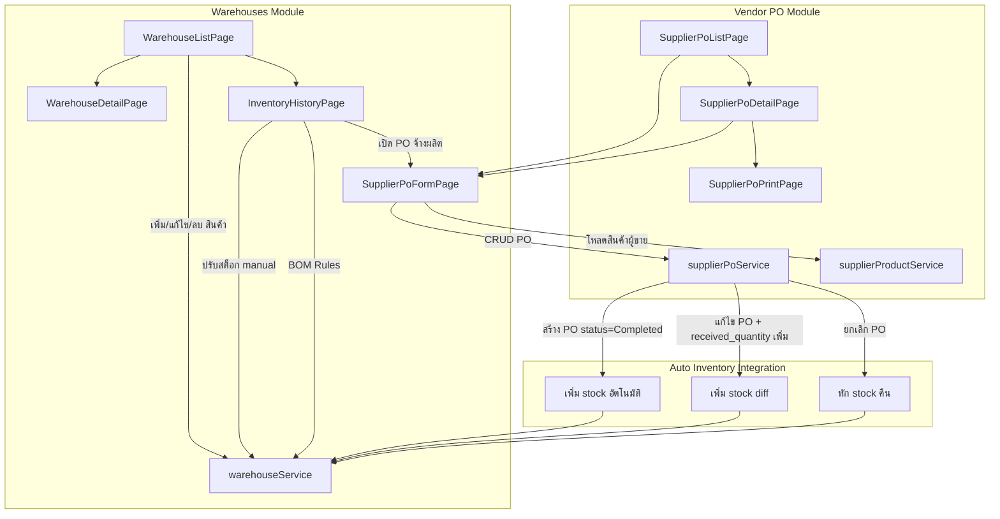
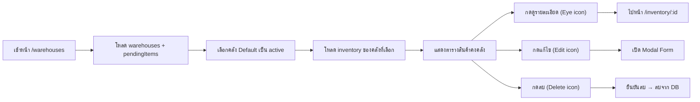
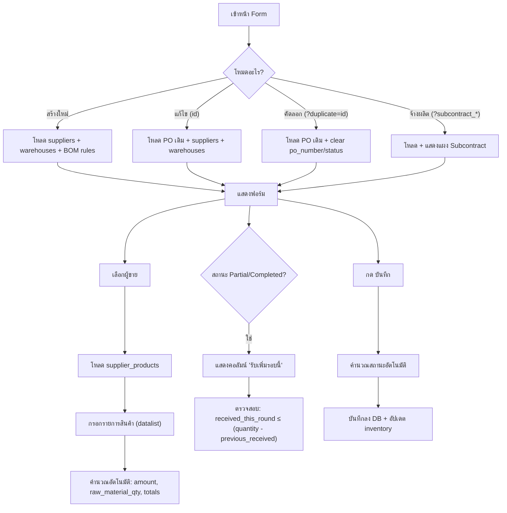

# 📋 วิเคราะห์โค้ดเชิงลึก: คลังสินค้า (Warehouses) & ใบสั่งซื้อผู้ขาย (Vendor PO)

> สร้างเมื่อ: 21 พฤษภาคม 2569 | วิเคราะห์จากซอร์สโค้ดจริงทั้งหมด

---

## 📁 ไฟล์ที่เกี่ยวข้อง

### คลังสินค้า (Warehouses)
| ไฟล์ | ประเภท | บรรทัด | คำอธิบาย |
|---|---|---|---|
| [WarehouseListPage.jsx](file:///Users/bell/.gemini/antigravity/scratch/factory_dashboard/src/pages/WarehouseListPage.jsx) | Page | 475 | หน้ารายการคลัง + ดูสินค้าทุกคลัง |
| [WarehouseDetailPage.jsx](file:///Users/bell/.gemini/antigravity/scratch/factory_dashboard/src/pages/WarehouseDetailPage.jsx) | Page | 371 | หน้ารายละเอียดคลังเฉพาะ |
| [InventoryHistoryPage.jsx](file:///Users/bell/.gemini/antigravity/scratch/factory_dashboard/src/pages/InventoryHistoryPage.jsx) | Page | 583 | Stock Card + ปรับสต็อก + BOM Rules |
| [WarehouseInventoryComponent.jsx](file:///Users/bell/.gemini/antigravity/scratch/factory_dashboard/src/components/WarehouseInventoryComponent.jsx) | Component | 377 | **ไม่ได้ถูกใช้งานจริง** (Dead Code) |
| [warehouseService.js](file:///Users/bell/.gemini/antigravity/scratch/factory_dashboard/src/services/warehouseService.js) | Service | 429 | CRUD คลัง + Inventory + Logs |

### ใบสั่งซื้อผู้ขาย (Vendor PO)
| ไฟล์ | ประเภท | บรรทัด | คำอธิบาย |
|---|---|---|---|
| [SupplierPoListPage.jsx](file:///Users/bell/.gemini/antigravity/scratch/factory_dashboard/src/pages/SupplierPoListPage.jsx) | Page | 411 | รายการ PO ทั้งหมด + KPI + กรอง |
| [SupplierPoFormPage.jsx](file:///Users/bell/.gemini/antigravity/scratch/factory_dashboard/src/pages/SupplierPoFormPage.jsx) | Page | 838 | ฟอร์มสร้าง/แก้ไข/รับสินค้า/คัดลอก PO |
| [SupplierPoDetailPage.jsx](file:///Users/bell/.gemini/antigravity/scratch/factory_dashboard/src/pages/SupplierPoDetailPage.jsx) | Page | 365 | หน้ารายละเอียด PO |
| [SupplierPoPrintPage.jsx](file:///Users/bell/.gemini/antigravity/scratch/factory_dashboard/src/pages/SupplierPoPrintPage.jsx) | Page | 115 | หน้าพรีวิว + พิมพ์ PO |
| [SupplierPoPrintTemplate.jsx](file:///Users/bell/.gemini/antigravity/scratch/factory_dashboard/src/components/SupplierPoPrintTemplate.jsx) | Component | 224 | เทมเพลตพิมพ์ A4 |
| [supplierPoService.js](file:///Users/bell/.gemini/antigravity/scratch/factory_dashboard/src/services/supplierPoService.js) | Service | 630 | CRUD PO + ระบบรับสินค้า + ยกเลิก |
| [supplierProductService.js](file:///Users/bell/.gemini/antigravity/scratch/factory_dashboard/src/services/supplierProductService.js) | Service | 169 | สินค้าของผู้ขาย |
| [bomCalculator.js](file:///Users/bell/.gemini/antigravity/scratch/factory_dashboard/src/utils/bomCalculator.js) | Utility | 41 | คำนวณวัตถุดิบจาก BOM Rules |

---

## 🏗 สถาปัตยกรรมระบบ

---

## 🔄 Flow การทำงาน: คลังสินค้า (Warehouses)

### 1. หน้ารายการคลัง ([WarehouseListPage.jsx](file:///Users/bell/.gemini/antigravity/scratch/factory_dashboard/src/pages/WarehouseListPage.jsx))

**ฟีเจอร์หลัก:**
- แสดงคลังสินค้าทั้งหมดเป็น Tab บนหัวเพจ
- เปลี่ยนคลังได้ทันทีโดยกด Tab
- แสดงข้อมูลคลัง (ที่อยู่, ผู้ติดต่อ, โทร)
- ค้นหาสินค้าด้วย ชื่อ/SKU
- ตารางแสดง: ชื่อ, ประเภท (วัตถุดิบ/FG), SKU, จำนวน, **กำลังมาเพิ่ม (จาก PO)**, หน่วย, สถานะ
- Modal สำหรับ เพิ่ม/แก้ไข สินค้า (product_type, product_name, sku, quantity, unit, min_stock)
- แสดง badge "ของใกล้หมด" เมื่อ quantity ≤ min_stock
- คอลัมน์ "กำลังมาเพิ่ม" แสดง pending PO items ที่ description ตรงกับ product_name

### 2. หน้ารายละเอียดคลัง ([WarehouseDetailPage.jsx](file:///Users/bell/.gemini/antigravity/scratch/factory_dashboard/src/pages/WarehouseDetailPage.jsx))

**ฟีเจอร์:** เหมือนกับ ListPage แต่แสดงเฉพาะคลังเดียว (ดูด้วย warehouse ID)

### 3. หน้าประวัติสินค้า ([InventoryHistoryPage.jsx](file:///Users/bell/.gemini/antigravity/scratch/factory_dashboard/src/pages/InventoryHistoryPage.jsx))

**ฟีเจอร์หลัก:**
- แสดง KPI Cards: คลังสินค้า, จำนวนคงเหลือ, กำลังมา(PO), รวมนำเข้า, รวมนำออก
- **BOM Rules Section**: ตั้งค่าสูตรการผลิต (วัตถุดิบ → สินค้าสำเร็จรูป)
- **Stock Card Table**: ประวัติเข้า-ออกทั้งหมด (วันที่, ประเภท, จำนวน, ยอดก่อน/หลัง, ที่มา, ผู้ทำรายการ, หมายเหตุ)
- **Manual Adjustment Modal**: ปรับสต็อก (เข้า/ออก) + บันทึกเหตุผล
- ปุ่ม "เปิด PO ผลิต" → ไปหน้า PO Form พร้อม query params สำหรับ subcontracting
- ปุ่ม "บันทึกยอดเริ่มต้น" (เมื่อไม่มี log)
- ปุ่ม "พิมพ์ Stock Card" (window.print)

---

## 🔄 Flow การทำงาน: ใบสั่งซื้อผู้ขาย (Vendor PO)

### 1. หน้ารายการ PO ([SupplierPoListPage.jsx](file:///Users/bell/.gemini/antigravity/scratch/factory_dashboard/src/pages/SupplierPoListPage.jsx))

**ฟีเจอร์หลัก:**
- **KPI Cards** (4 ใบ): Draft, Partial, Completed, Cancelled
- ค้นหาด้วย เลขที่ PO / ชื่อผู้ขาย / ชื่อสินค้าใน PO items
- กรองด้วย วันที่สั่งซื้อ / วันกำหนดส่ง
- ตารางจัดกลุ่มตามเดือน-ปี (เรียงจากใหม่ → เก่า)
- **Expandable Rows**: กดแถวเพื่อดูรายการสินค้าใน PO
- ปุ่ม Actions: ดู, แก้ไข, คัดลอก, พิมพ์, ลบ
- Export Excel ทั้งหมด / ต่อเดือน
- แสดงสถานะรับสินค้า (received/total quantity)
- ลบได้เฉพาะ Draft, แก้ไขได้เฉพาะ Draft+Partial

### 2. ฟอร์มสร้าง/แก้ไข PO ([SupplierPoFormPage.jsx](file:///Users/bell/.gemini/antigravity/scratch/factory_dashboard/src/pages/SupplierPoFormPage.jsx))

**ฟีเจอร์หลัก:**
- **4 โหมด**: สร้างใหม่ / แก้ไข / คัดลอก / จ้างผลิต (Subcontract)
- ฟิลด์: เลขที่ PO (auto-gen), ผู้ขาย, วันที่สั่ง, คลังส่ง, กำหนดส่ง, เครดิต, อ้างอิง, หมายเหตุ, ผู้สั่ง, ผู้อนุมัติ
- รายการสินค้า: เลือกจาก datalist ของ supplier_products หรือพิมพ์เอง
- อัปโหลดรูปภาพต่อรายการ
- คำนวณ BOM อัตโนมัติเมื่อเลือกสินค้า
- คำนวณ sub_total / VAT / grand_total อัตโนมัติ
- **Auto-detect status**: ถ้าสั่ง Completed/Partial → ระบบตรวจ received_quantity จริง
- **Subcontract mode**: เบิกวัตถุดิบจากคลังอัตโนมัติเมื่อสร้าง PO ใหม่

### 3. หน้ารายละเอียด PO ([SupplierPoDetailPage.jsx](file:///Users/bell/.gemini/antigravity/scratch/factory_dashboard/src/pages/SupplierPoDetailPage.jsx))

**ฟีเจอร์หลัก:**
- แสดงข้อมูลผู้ขาย + คลังส่ง
- ตารางสินค้า (description, note, image, due_date, quantity, received_quantity, unit_price, amount)
- สรุปยอดเงิน (sub_total, VAT, grand_total)
- ข้อมูลการจัดซื้อ (วันที่, กำหนดส่ง, เครดิต, อ้างอิง, ผู้สั่ง, ผู้อนุมัติ)
- **การจัดการเอกสาร**: รับสินค้า / ยกเลิก PO (ตามสถานะ)
- Timestamps (สร้างเมื่อ, อัปเดตล่าสุด)

### 4. ระบบเชื่อมต่อ Inventory อัตโนมัติ ([supplierPoService.js](file:///Users/bell/.gemini/antigravity/scratch/factory_dashboard/src/services/supplierPoService.js))

#### สร้าง PO ใหม่ (`createSupplierPo`)
- Auto-gen PO number: `VPO{YYMM}{001-999}`
- ถ้าสถานะ = Completed → เพิ่ม stock ทันที (ใช้ received_quantity หรือ quantity)
- Match inventory ด้วย `product_name === item.description`
- ถ้ามีสินค้าในคลังแล้ว → เพิ่มจำนวน, ถ้าไม่มี → สร้างใหม่
- บันทึก inventory_logs ทุกรายการ

#### แก้ไข PO (`updateSupplierPo`)
- ลบ items เก่า + insert ใหม่ทั้งหมด (delete-then-insert pattern)
- คำนวณ diff ของ received_quantity (ใหม่ - เก่า)
- เพิ่ม stock เฉพาะส่วนต่าง (diff > 0) เท่านั้น

#### ยกเลิก PO (`cancelSupplierPo`)
- ตรวจสอบ stock ว่าพอหักคืนหรือไม่ (validation loop)
- หัก stock คืนตาม received_quantity
- บันทึก inventory_logs (OUT)
- เปลี่ยนสถานะเป็น Cancelled + ต่อท้าย remark

#### เปลี่ยนสถานะ (`updateStatus`)
- ถ้าเปลี่ยนเป็น Completed (ครั้งแรก) → เพิ่ม stock ทั้งหมด
- ⚠️ **ใช้ `item.quantity` แทน `item.received_quantity`** (แตกต่างจาก createSupplierPo)

---

## 🐛 ปัญหาและ Bug ที่พบ

### 🔴 ปัญหาระดับวิกฤต (Critical)

#### BUG-001: `showConfirm` ไม่ได้ import ใน InventoryHistoryPage
- **ไฟล์**: [InventoryHistoryPage.jsx:155](file:///Users/bell/.gemini/antigravity/scratch/factory_dashboard/src/pages/InventoryHistoryPage.jsx#L155)
- **ปัญหา**: ฟังก์ชัน `handleDeleteBomRule` เรียก `showConfirm` แต่ destructure จาก `useDialog()` ได้แค่ `showError` กับ `showAlert` (บรรทัด 17)
- **ผลกระทบ**: กดปุ่ม "ลบ" BOM Rule จะ **crash ทันที** (`showConfirm is not defined`)
- **แก้ไข**: เพิ่ม `showConfirm` ใน destructure → `const { showError, showAlert, showConfirm } = useDialog();`

#### BUG-002: `updateStatus` ใช้ quantity แทน received_quantity
- **ไฟล์**: [supplierPoService.js:534](file:///Users/bell/.gemini/antigravity/scratch/factory_dashboard/src/services/supplierPoService.js#L534)
- **ปัญหา**: เมื่อเปลี่ยนสถานะเป็น Completed ผ่านปุ่มใน DetailPage, ระบบเพิ่ม stock ด้วย `item.quantity` (จำนวนสั่ง) แทน `item.received_quantity` (จำนวนรับจริง)
- **ผลกระทบ**: ถ้า PO สั่งซื้อ 100 ชิ้นแต่รับจริง 80 ชิ้น → ระบบจะเพิ่ม stock 100 ชิ้น (มากเกิน 20 ชิ้น)
- **แก้ไข**: เปลี่ยน `Number(item.quantity)` เป็น `Number(item.received_quantity || item.quantity)` ทั้ง 2 จุด

#### BUG-003: WarehouseDetailPage ปุ่มจัดการอยู่ฝั่งขวา (ผิด AGENTS.md)
- **ไฟล์**: [WarehouseDetailPage.jsx:207](file:///Users/bell/.gemini/antigravity/scratch/factory_dashboard/src/pages/WarehouseDetailPage.jsx#L207)
- **ปัญหา**: คอลัมน์ "จัดการ" อยู่ฝั่งขวาสุดของตาราง + ไม่ใช้ class `table-actions`/`action-edit`/`action-delete` ตาม AGENTS.md
- **ผลกระทบ**: ไม่สอดคล้องกับมาตรฐาน UI → WarehouseListPage ทำถูกแล้ว, แต่ DetailPage ไม่ตรง
- **แก้ไข**: ย้ายคอลัมน์ "จัดการ" ไปฝั่งซ้ายสุด และใช้ class มาตรฐาน

#### BUG-004: WarehouseDetailPage colSpan ผิด
- **ไฟล์**: [WarehouseDetailPage.jsx:252](file:///Users/bell/.gemini/antigravity/scratch/factory_dashboard/src/pages/WarehouseDetailPage.jsx#L252)
- **ปัญหา**: ตาราง header มี 7 คอลัมน์ แต่ empty state ใช้ `colSpan="6"` → แสดงผลเพี้ยน
- **แก้ไข**: เปลี่ยนเป็น `colSpan="7"`

---

### 🟡 ปัญหาระดับปานกลาง (Medium)

#### BUG-005: WarehouseInventoryComponent.jsx เป็น Dead Code
- **ไฟล์**: [WarehouseInventoryComponent.jsx](file:///Users/bell/.gemini/antigravity/scratch/factory_dashboard/src/components/WarehouseInventoryComponent.jsx)
- **ปัญหา**: ไฟล์นี้ export เป็น `WarehouseDetailPage` (ชื่อเดียวกับ pages/WarehouseDetailPage.jsx) แต่ **ไม่มีที่ไหน import ไปใช้** ในโปรเจกต์
- **ข้อสังเกต**: มี `usePermissions` ไม่ได้ import, ไม่มีฟังก์ชันค้นหา, ยังใช้ Tab filter (material/finished_good) แทน search
- **แก้ไข**: ลบไฟล์ หรือพิจารณารวมฟีเจอร์ที่ขาดไปเข้ากับ WarehouseDetailPage ที่ใช้จริง

#### BUG-006: Inventory Matching ใช้ product_name = description (Fragile)
- **ไฟล์**: [supplierPoService.js:156](file:///Users/bell/.gemini/antigravity/scratch/factory_dashboard/src/services/supplierPoService.js#L156), [supplierPoService.js:293](file:///Users/bell/.gemini/antigravity/scratch/factory_dashboard/src/services/supplierPoService.js#L293)
- **ปัญหา**: ระบบจับคู่สินค้าในคลังกับ PO items ด้วย `inv.product_name === item.description` (เทียบ string)
- **ผลกระทบ**: ถ้าพิมพ์ชื่อต่างกันแม้แค่ช่องว่าง/ตัวพิมพ์ → สร้างรายการซ้ำ เช่น "สกรู M8" vs "สกรู m8" vs "สกรู M8 "
- **แก้ไข**: ควร match ด้วย `supplier_product_id` หรือ SKU แทน, หรืออย่างน้อย normalize string ก่อนเทียบ

#### BUG-007: Pending Items Matching ใช้ description = product_name (Same Issue)
- **ไฟล์**: [WarehouseListPage.jsx:334](file:///Users/bell/.gemini/antigravity/scratch/factory_dashboard/src/pages/WarehouseListPage.jsx#L334)
- **ปัญหา**: คอลัมน์ "กำลังมาเพิ่ม" match `pendingItems.description === item.product_name`
- **ผลกระทบ**: ถ้าชื่อไม่ตรงเป๊ะ → จะแสดง "-" แม้จะมี PO อยู่จริง

#### BUG-008: การลบ PO ลบได้แม้จะ Partial (มี received_quantity > 0)
- **ไฟล์**: [supplierPoService.js:357-378](file:///Users/bell/.gemini/antigravity/scratch/factory_dashboard/src/services/supplierPoService.js#L357-L378)
- **ปัญหา**: `deleteSupplierPo` ตรวจแค่ `po.status === 'Completed'` แต่ไม่ได้ตรวจ `Partial` → ถ้า PO สถานะ Partial (รับสินค้าบางส่วนแล้ว) สามารถลบได้ แต่ stock จะไม่ถูกหักคืน
- **ผลกระทบ**: Stock เกินจริงหลังลบ PO ที่ Partial
- **แก้ไข**: เพิ่มเงื่อนไข `if (po?.status === 'Completed' || po?.status === 'Partial')`

#### BUG-009: DetailPage สถานะ Badge แสดง Partial แทน Completed อย่างผิดพลาด
- **ไฟล์**: [SupplierPoDetailPage.jsx:108](file:///Users/bell/.gemini/antigravity/scratch/factory_dashboard/src/pages/SupplierPoDetailPage.jsx#L108)
- **ปัญหา**: มี logic override สถานะ badge → ถ้า status='Completed' แต่ items บางรายการ received < quantity → แสดง Partial
- **ข้อสังเกต**: logic นี้ดี (ป้องกันข้อมูลไม่สอดคล้อง) แต่ **ควรแก้ต้นเหตุ** ใน service layer แทนที่จะ "แปะพลาสเตอร์" ที่ UI

#### BUG-010: SupplierPoFormPage ไม่ใช้ PageHeader component
- **ไฟล์**: [SupplierPoFormPage.jsx:442-466](file:///Users/bell/.gemini/antigravity/scratch/factory_dashboard/src/pages/SupplierPoFormPage.jsx#L442-L466)
- **ปัญหา**: ใช้ `<h1>` + ปุ่มวาง inline แทนการใช้ `PageHeader` ตาม pattern ที่กำหนด → ปุ่ม Save อยู่ขวาบน (ถูก) แต่ไม่ใช้ component มาตรฐาน

#### BUG-011: SupplierPoFormPage ยังมีปุ่ม Back แบบเก่า
- **ไฟล์**: [SupplierPoFormPage.jsx:392-397](file:///Users/bell/.gemini/antigravity/scratch/factory_dashboard/src/pages/SupplierPoFormPage.jsx#L392-L397)
- **ปัญหา**: มีปุ่ม "ย้อนกลับ" แบบ inline อยู่นอก form → ควรใช้ `PageHeader` component ที่มี `onBack` prop

---

### 🟢 ปัญหาระดับเบา (Low)

#### BUG-012: WarehouseListPage activeTab state ไม่ได้ใช้
- **ไฟล์**: [WarehouseListPage.jsx:22](file:///Users/bell/.gemini/antigravity/scratch/factory_dashboard/src/pages/WarehouseListPage.jsx#L22)
- **ปัญหา**: มี `activeTab` state แต่ comment บอกว่า "removed tab filter" → ไม่มีผลอะไรแล้ว, code ตกค้าง
- **แก้ไข**: ลบ `activeTab` state ที่ไม่ใช้

#### BUG-013: SupplierPoDetailPage ปุ่มยกเลิก Draft ใช้ `handleStatusUpdate('Cancelled')` แทน `cancelSupplierPo`
- **ไฟล์**: [SupplierPoDetailPage.jsx:274](file:///Users/bell/.gemini/antigravity/scratch/factory_dashboard/src/pages/SupplierPoDetailPage.jsx#L274)
- **ปัญหา**: ปุ่ม "ยกเลิกรายการ" สำหรับ Draft → เรียก `handleStatusUpdate('Cancelled')` → ซึ่งจะ trigger `updateStatus` ที่อาจเพิ่ม stock (ถ้ามีเงื่อนไข newly completed) — แต่เนื่องจากมันไม่ใช่ Completed จึงไม่มีผลข้างเคียง **ในตอนนี้**
- **ข้อสังเกต**: แต่เสี่ยงถ้ามีการแก้ logic `updateStatus` ในอนาคต → ควรใช้ `cancelSupplierPo` เหมือน Partial/Completed

#### BUG-014: Print Template แสดง `po.contact_person` แทนที่จะเป็น `supplier.contact_person`
- **ไฟล์**: [SupplierPoPrintTemplate.jsx:47](file:///Users/bell/.gemini/antigravity/scratch/factory_dashboard/src/components/SupplierPoPrintTemplate.jsx#L47)
- **ปัญหา**: `ATTN:` แสดง `po.contact_person` — field นี้อยู่ใน `supplier_pos` table, ไม่ใช่ `suppliers` table → อาจเป็น null เสมอ
- **แก้ไข**: เปลี่ยนเป็น `supplier.contact_person || '-'`

#### BUG-015: Print Template Due Date ใช้ delivery_date ของ PO ไม่ใช้ item.due_date
- **ไฟล์**: [SupplierPoPrintTemplate.jsx:126](file:///Users/bell/.gemini/antigravity/scratch/factory_dashboard/src/components/SupplierPoPrintTemplate.jsx#L126)
- **ปัญหา**: คอลัมน์ "กำหนดส่ง" แต่ละรายการแสดง `po.delivery_date` เหมือนกันทุกแถว แทนที่จะใช้ `item.due_date` ที่เฉพาะเจาะจง
- **แก้ไข**: เปลี่ยนเป็น `item.due_date ? new Date(item.due_date).toLocaleDateString('th-TH') : po.delivery_date ? new Date(po.delivery_date).toLocaleDateString('th-TH') : '-'`

---

## ⚠️ ฟังก์ชันที่ยังขาด / ไม่สมบูรณ์

### ❌ ขาดหายไปจริง

| # | รายการที่ขาด | ระดับความสำคัญ | หมายเหตุ |
|---|---|---|---|
| 1 | **ไม่มีหน้า/ฟอร์มสำหรับ CRUD ตัวคลังสินค้าเอง** | 🔴 High | สามารถเพิ่ม/แก้ไข/ลบคลังได้แค่ผ่าน SettingsPage เท่านั้น → ไม่มี UI เฉพาะสำหรับจัดการ warehouses (service มีครบ) |
| 2 | **WarehouseDetailPage ไม่มีคอลัมน์ "กำลังมาเพิ่ม"** | 🟡 Medium | WarehouseListPage มี but DetailPage ไม่มี → ไม่โหลด pendingItems |
| 3 | **InventoryHistoryPage ไม่มี permission check** สำหรับปุ่ม "ปรับสต็อก" | 🟡 Medium | ปุ่ม "ปรับสต็อก" แสดงให้ทุกคนเห็น ไม่ว่าจะมี permission `warehouses.edit` หรือไม่ |
| 4 | **InventoryHistoryPage ไม่มี permission check** สำหรับ BOM Rules (เพิ่ม/ลบ) | 🟡 Medium | เช่นเดียวกัน |
| 5 | **ไม่มีการ validate stock ติดลบ** เมื่อปรับสต็อก OUT manual | 🟡 Medium | ใน `adjustStock` ไม่ตรวจว่า newQty < 0 → stock อาจติดลบ |
| 6 | **SupplierPoFormPage ไม่มี "ยกเลิก" confirmation** เมื่อมีข้อมูลที่ยังไม่ได้บันทึก | 🟢 Low | กดปุ่ม "ย้อนกลับ" จะออกทันทีโดยไม่ถาม |
| 7 | **ไม่มี Pagination** ในตาราง Warehouse Inventory และ PO List | 🟢 Low | ข้อมูลเยอะจะโหลดทีเดียว |
| 8 | **SupplierPoListPage ไม่มี filter ตาม status** | 🟢 Low | กรองได้แค่วันที่ ไม่สามารถกรองเฉพาะ Draft/Partial/Completed |
| 9 | **WarehouseListPage ไม่มี KPI Cards** | 🟡 Medium | ตาม AGENTS.md: "ทุก Tab บน Dashboard ต้องมี KPI Cards" |

---

## ⚙️ Database Tables ที่เกี่ยวข้อง (สรุปจาก Service Layer)

| Table | ใช้ใน Service | คำอธิบาย |
|---|---|---|
| `warehouses` | warehouseService | คลังสินค้า (id, name, code, type, address, phone, contact_person, is_default, supplier_id) |
| `warehouse_inventory` | warehouseService | สินค้าในคลัง (id, warehouse_id, product_type, product_name, sku, quantity, unit, min_stock) |
| `inventory_logs` | warehouseService | ประวัติเข้า-ออก (inventory_id, type, qty, old_quantity, balance, source_type, source_id, reference_no, remark, performed_by) |
| `inventory_bom_rules` | warehouseService | สูตรการผลิต (inventory_id, supplier_product_id, raw_material_qty, finished_product_qty) |
| `suppliers` | supplierPoService | ผู้ขาย |
| `supplier_pos` | supplierPoService | ใบสั่งซื้อ (id, po_number, supplier_id, delivery_warehouse_id, date, delivery_date, status, sub_total, vat_rate, vat_amount, grand_total, ...) |
| `supplier_po_items` | supplierPoService | รายการสินค้าใน PO (po_id, item_no, description, supplier_product_id, quantity, received_quantity, unit, unit_price, amount, due_date, note, image_url) |
| `supplier_products` | supplierProductService | สินค้าของผู้ขาย (supplier_id, name, unit, price) |

---

## 🧪 Test Script (UAT)

### TC-WH: คลังสินค้า (Warehouse)

#### TC-WH-001: ดูรายการคลังสินค้า
| ขั้นตอน | สิ่งที่คาดหวัง | ผล |
|---|---|---|
| 1. เข้าเมนู "คลังสินค้า" | แสดงหน้ารายการคลัง, มี Tab ของแต่ละคลัง | ⬜ |
| 2. ตรวจสอบว่าคลัง Default ถูกเลือกเป็น active | Tab ของคลัง Default มี highlight สีม่วง + badge "Default" | ⬜ |
| 3. ตรวจสอบข้อมูลคลังด้านบน | แสดง ประเภท (คลังของเรา/คลังผู้ขาย), รหัส, ที่อยู่, ผู้ติดต่อ, เบอร์โทร | ⬜ |
| 4. ตรวจสอบตารางสินค้า | แสดง จัดการ, ชื่อ, ประเภท, SKU, จำนวน, กำลังมาเพิ่ม, หน่วย, สถานะ | ⬜ |

#### TC-WH-002: เพิ่มสินค้าในคลัง
| ขั้นตอน | สิ่งที่คาดหวัง | ผล |
|---|---|---|
| 1. กดปุ่ม "เพิ่มรายการใหม่" | แสดง Modal Form | ⬜ |
| 2. เลือกประเภท "วัตถุดิบ" | Dropdown แสดง 2 ตัวเลือก (วัตถุดิบ, สินค้าสำเร็จรูป) | ⬜ |
| 3. กรอกข้อมูล: ชื่อ="เหล็กทดสอบ", SKU="STL-001", จำนวน=100, หน่วย=KG, ขั้นต่ำ=10 | กรอกได้ปกติ | ⬜ |
| 4. กด "บันทึกรายการ" | Modal ปิด + แสดง Alert "เพิ่มสินค้าในคลังสำเร็จ" + สินค้าปรากฏในตาราง | ⬜ |
| 5. ตรวจสอบว่าสินค้าใหม่มี status "ปกติ" (เพราะ 100 > 10) | Badge สีเขียว "ปกติ" | ⬜ |

#### TC-WH-003: แก้ไขสินค้าในคลัง
| ขั้นตอน | สิ่งที่คาดหวัง | ผล |
|---|---|---|
| 1. กดปุ่ม Edit ที่สินค้า "เหล็กทดสอบ" | Modal แสดงข้อมูลเดิม pre-filled | ⬜ |
| 2. เปลี่ยนจำนวนเป็น 5 | ฟิลด์อัปเดตเป็น 5 | ⬜ |
| 3. กด "บันทึกรายการ" | Modal ปิด + Alert "อัปเดตข้อมูลสินค้าสำเร็จ" + ตารางแสดงจำนวน 5 | ⬜ |
| 4. ตรวจสอบ status | Badge เปลี่ยนเป็นสีแดง "ของใกล้หมด" (5 ≤ 10) | ⬜ |

#### TC-WH-004: ลบสินค้าจากคลัง
| ขั้นตอน | สิ่งที่คาดหวัง | ผล |
|---|---|---|
| 1. กดปุ่ม Delete ที่สินค้า | แสดง Dialog ยืนยัน "ยืนยันการลบสินค้านี้ออกจากคลัง?" | ⬜ |
| 2. กด "ตกลง" | สินค้าหายจากตาราง | ⬜ |
| 3. กด "ยกเลิก" แทน | สินค้ายังอยู่ | ⬜ |

#### TC-WH-005: ค้นหาสินค้า
| ขั้นตอน | สิ่งที่คาดหวัง | ผล |
|---|---|---|
| 1. พิมพ์ชื่อสินค้าในช่องค้นหา | ตารางกรองแสดงเฉพาะรายการที่ตรงกับคำค้น | ⬜ |
| 2. พิมพ์ SKU ในช่องค้นหา | กรองด้วย SKU ได้ | ⬜ |
| 3. ลบคำค้นทั้งหมด | แสดงสินค้าทั้งหมด | ⬜ |

#### TC-WH-006: เปลี่ยนคลัง
| ขั้นตอน | สิ่งที่คาดหวัง | ผล |
|---|---|---|
| 1. กด Tab คลังอื่น | Tab highlight เปลี่ยน + ข้อมูลคลังด้านบนเปลี่ยน + ตารางสินค้าโหลดใหม่ | ⬜ |

#### TC-WH-007: ดูประวัติสินค้า (Stock Card)
| ขั้นตอน | สิ่งที่คาดหวัง | ผล |
|---|---|---|
| 1. กดปุ่ม Eye (ดูรายละเอียด) ที่สินค้า | ไปหน้า InventoryHistory | ⬜ |
| 2. ตรวจสอบ KPI Cards | แสดง: คลัง, จำนวนคงเหลือ, กำลังมา(PO), รวมนำเข้า, รวมนำออก | ⬜ |
| 3. ตรวจสอบตาราง Stock Card | แสดงประวัติเข้า-ออก (ถ้ามี) | ⬜ |

#### TC-WH-008: ปรับสต็อกด้วยมือ
| ขั้นตอน | สิ่งที่คาดหวัง | ผล |
|---|---|---|
| 1. กดปุ่ม "ปรับสต็อก" | แสดง Modal | ⬜ |
| 2. เลือก "นำเข้า (+)", จำนวน=50, หมายเหตุ="ตรวจนับสต็อก" | กรอกได้ปกติ | ⬜ |
| 3. กด "บันทึก" | Modal ปิด + สต็อกเพิ่ม 50 + มีรายการในตาราง Stock Card | ⬜ |
| 4. ลองเบิกออก: เลือก "เบิกออก (-)", จำนวน=20 | สต็อกลด 20 | ⬜ |

#### TC-WH-009: BOM Rules (ตั้งค่าสูตรการผลิต)
| ขั้นตอน | สิ่งที่คาดหวัง | ผล |
|---|---|---|
| 1. กดปุ่ม "เพิ่มสูตรการผลิต" | แสดง Modal BOM | ⬜ |
| 2. เลือกสินค้าที่ผลิตได้, ใส่วัตถุดิบ=10, ผลิตได้=200 | กรอกได้ปกติ | ⬜ |
| 3. กด "บันทึก" | สูตรปรากฏในตาราง + แสดงอัตราส่วน 0.0500 | ⬜ |
| 4. 🔴 กด "ลบ" สูตร | **⚠️ BUG: จะ crash เพราะ showConfirm ไม่ได้ import** | ⬜ |

---

### TC-PO: ใบสั่งซื้อผู้ขาย (Vendor PO)

#### TC-PO-001: ดูรายการ PO
| ขั้นตอน | สิ่งที่คาดหวัง | ผล |
|---|---|---|
| 1. เข้าเมนู "ใบสั่งซื้อผู้ขาย" | แสดงหน้ารายการ PO | ⬜ |
| 2. ตรวจสอบ KPI Cards | แสดง 4 cards: Draft, Partial, Completed, Cancelled | ⬜ |
| 3. ตรวจสอบตาราง | แสดง PO จัดกลุ่มเป็นเดือน-ปี พ.ศ. | ⬜ |
| 4. กด Expand row | แสดงรายการสินค้าใน PO | ⬜ |

#### TC-PO-002: สร้าง PO ใหม่ (สถานะ Draft)
| ขั้นตอน | สิ่งที่คาดหวัง | ผล |
|---|---|---|
| 1. กดปุ่ม "สร้างใบสั่งซื้อใหม่" | ไปหน้า Form | ⬜ |
| 2. ปล่อย เลขที่ PO ว่าง | ระบบจะ auto-generate | ⬜ |
| 3. เลือกผู้ขาย | มี dropdown แสดงผู้ขายทั้งหมด + โหลดสินค้าของผู้ขายนั้น | ⬜ |
| 4. เลือกวันที่สั่งซื้อ (default=วันนี้) | ✓ | ⬜ |
| 5. เลือกคลังส่ง (default=คลังหลัก) | ✓ | ⬜ |
| 6. เลือกวันกำหนดส่ง | ✓ | ⬜ |
| 7. เลือกสินค้าจาก datalist | ราคา/หน่วย fill อัตโนมัติ | ⬜ |
| 8. แก้จำนวนเป็น 50 | จำนวนเงิน คำนวณอัตโนมัติ (50 × unit_price) | ⬜ |
| 9. เพิ่ม Note + รูปภาพ | อัปโหลดได้ + แสดง preview | ⬜ |
| 10. กดเพิ่มรายการ (ปุ่ม +) | เพิ่มแถวใหม่ได้ | ⬜ |
| 11. กรอกผู้สั่งซื้อ (default=current user) + ผู้อนุมัติ | ✓ | ⬜ |
| 12. ตรวจสอบยอดรวม: SUB TOTAL, VAT 7%, TOTAL | คำนวณถูกต้อง | ⬜ |
| 13. สถานะ = Draft → กด "บันทึก" | Alert "สร้างใบสั่งซื้อสำเร็จ" + redirect ไปรายการ PO | ⬜ |
| 14. ตรวจสอบว่าไม่มี stock เพิ่มในคลัง | ✓ (Draft ไม่เพิ่ม stock) | ⬜ |

#### TC-PO-003: สร้าง PO สถานะ Completed (เพิ่ม stock ทันที)
| ขั้นตอน | สิ่งที่คาดหวัง | ผล |
|---|---|---|
| 1. สร้าง PO ใหม่ + เลือกสถานะ "Completed" | ✓ | ⬜ |
| 2. กรอกรายการสินค้า + บันทึก | Alert สำเร็จ | ⬜ |
| 3. ไปดูหน้าคลังสินค้า | สินค้าที่สั่งต้องมีจำนวนเพิ่มขึ้น | ⬜ |
| 4. กดดู Stock Card | มี log "IN" + reference PO number | ⬜ |

#### TC-PO-004: รับสินค้าเข้าคลัง (Receive Mode)
| ขั้นตอน | สิ่งที่คาดหวัง | ผล |
|---|---|---|
| 1. เปิด PO ที่สถานะ Draft → กด "รับสินค้าเข้าคลัง" | ไปหน้า Form + แสดงคอลัมน์ "รับเพิ่มรอบนี้" | ⬜ |
| 2. กรอก received_this_round = 30 (จากสั่ง 50) | ✓ | ⬜ |
| 3. กรอกเกินจำนวนสั่ง (เช่น 60 จาก 50) | ระบบตัดเหลือ 50 + แสดง Alert | ⬜ |
| 4. บันทึก | สถานะเปลี่ยนเป็น Partial + stock เพิ่ม 30 ในคลัง | ⬜ |
| 5. เปิด PO อีกครั้ง → กด "รับสินค้าเพิ่มเติม" | แสดง "รับแล้วรอบก่อน: 30", ช่อง received_this_round = 0 | ⬜ |
| 6. กรอก received_this_round = 20 + บันทึก | สถานะเปลี่ยนเป็น Completed + stock เพิ่มอีก 20 | ⬜ |

#### TC-PO-005: คัดลอก PO
| ขั้นตอน | สิ่งที่คาดหวัง | ผล |
|---|---|---|
| 1. กดปุ่ม Copy ที่ PO ใดๆ | ไปหน้า Form + ข้อมูล pre-filled + เลขที่ PO ว่าง + สถานะ Draft | ⬜ |
| 2. บันทึก | สร้าง PO ใหม่ + PO number ใหม่ | ⬜ |

#### TC-PO-006: ยกเลิก PO
| ขั้นตอน | สิ่งที่คาดหวัง | ผล |
|---|---|---|
| 1. ยกเลิก PO ที่ Draft | เปลี่ยนสถานะเป็น Cancelled + **ไม่หักสต็อก** | ⬜ |
| 2. ยกเลิก PO ที่ Partial (รับ 30 จาก 50) | ยืนยัน → หักสต็อก 30 ออกจากคลัง + log "OUT" | ⬜ |
| 3. ยกเลิก PO ที่ Completed + stock ไม่พอหัก | แสดง Error: "สต็อกสินค้า X ไม่เพียงพอ..." | ⬜ |

#### TC-PO-007: ลบ PO
| ขั้นตอน | สิ่งที่คาดหวัง | ผล |
|---|---|---|
| 1. ลบ PO ที่ Draft | ลบได้ + หายจากรายการ | ⬜ |
| 2. ลบ PO ที่ Completed | Error: "ไม่สามารถลบใบสั่งซื้อที่รับสินค้าเข้าคลังแล้ว" | ⬜ |
| 3. 🔴 ลบ PO ที่ Partial | **⚠️ BUG: ลบได้โดยไม่หักสต็อกคืน (stock จะเกิน)** | ⬜ |

#### TC-PO-008: พิมพ์ PO
| ขั้นตอน | สิ่งที่คาดหวัง | ผล |
|---|---|---|
| 1. กดปุ่ม Printer | ไปหน้า Preview | ⬜ |
| 2. ตรวจสอบข้อมูลบนเอกสาร | ครบถ้วน: ชื่อบริษัท, ผู้ขาย, วันที่, เลขที่ PO, รายการสินค้า, ยอดรวม | ⬜ |
| 3. 🔴 ตรวจสอบ ATTN field | **⚠️ BUG: อาจแสดง "-" เสมอ (ใช้ po.contact_person แทน supplier.contact_person)** | ⬜ |
| 4. กด "พิมพ์ใบสั่งซื้อ" | Browser print dialog | ⬜ |

#### TC-PO-009: ค้นหาและกรอง PO
| ขั้นตอน | สิ่งที่คาดหวัง | ผล |
|---|---|---|
| 1. พิมพ์เลขที่ PO ในช่องค้นหา | กรองแสดงเฉพาะ PO ที่ตรง | ⬜ |
| 2. พิมพ์ชื่อผู้ขาย | กรองได้ | ⬜ |
| 3. พิมพ์ชื่อสินค้าใน PO | กรองได้ (ค้นภายใน items) | ⬜ |
| 4. เลือกช่วงวันที่สั่งซื้อ | กรองได้ | ⬜ |
| 5. เปลี่ยนเป็นกรองด้วย "วันกำหนดส่ง" | กรองด้วย delivery_date | ⬜ |
| 6. กด "ล้างตัวกรอง" | กลับเป็นแสดงทั้งหมด | ⬜ |

#### TC-PO-010: Export Excel
| ขั้นตอน | สิ่งที่คาดหวัง | ผล |
|---|---|---|
| 1. กดปุ่ม "Export All" | ดาวน์โหลดไฟล์ .xlsx ทุก PO | ⬜ |
| 2. กดปุ่ม "ส่งออก Excel" ที่หัวเดือน | ดาวน์โหลดเฉพาะ PO ของเดือนนั้น | ⬜ |

#### TC-PO-011: Subcontract (จ้างผลิต)
| ขั้นตอน | สิ่งที่คาดหวัง | ผล |
|---|---|---|
| 1. จากหน้า Stock Card → กด "เปิด PO ผลิต" | ไปหน้า PO Form + แสดงแผง Subcontract ด้านบน | ⬜ |
| 2. แสดงชื่อวัตถุดิบที่จะเบิก | ✓ | ⬜ |
| 3. เลือกสินค้าที่มี BOM Rule | จำนวนเบิกคำนวณอัตโนมัติ + แสดง note | ⬜ |
| 4. บันทึก PO | สร้าง PO + ตัดสต็อกวัตถุดิบจากคลังอัตโนมัติ | ⬜ |

---

## 📊 สรุปลำดับความสำคัญในการแก้ไข

| ลำดับ | Bug ID | รายละเอียด | ความเร่งด่วน |
|---|---|---|---|
| 1 | **BUG-001** | showConfirm ไม่ได้ import → Crash เมื่อลบ BOM Rule | 🔴 Critical |
| 2 | **BUG-002** | updateStatus ใช้ quantity แทน received_quantity → Stock ผิด | 🔴 Critical |
| 3 | **BUG-008** | ลบ PO Partial ได้โดยไม่หัก stock คืน | 🔴 Critical |
| 4 | **BUG-003** | WarehouseDetailPage ปุ่มจัดการอยู่ขวา (ผิดมาตรฐาน) | 🟡 Medium |
| 5 | **BUG-004** | colSpan ผิดใน WarehouseDetailPage | 🟡 Medium |
| 6 | **BUG-006** | Inventory matching ด้วย string fragile | 🟡 Medium |
| 7 | **BUG-014** | Print Template ATTN ใช้ po.contact_person | 🟡 Medium |
| 8 | **BUG-015** | Print Template due_date ใช้ po.delivery_date | 🟡 Medium |
| 9 | **BUG-005** | Dead code: WarehouseInventoryComponent.jsx | 🟢 Low |
| 10 | **BUG-009** | DetailPage status badge override | 🟢 Low |
| 11 | **BUG-010** | SupplierPoFormPage ไม่ใช้ PageHeader | 🟢 Low |
| 12 | **BUG-012** | activeTab state ตกค้าง | 🟢 Low |
| 13 | **BUG-013** | ยกเลิก Draft ใช้ผิดฟังก์ชัน | 🟢 Low |

---

## 📝 คำแนะนำเพิ่มเติม

> [!IMPORTANT]
> **Bug ลำดับ 1-3 ควรแก้ทันที** เพราะส่งผลกระทบต่อ Data Integrity (stock ผิด) และ App Crash

> [!TIP]
> **การแก้ BUG-006 (String matching)** เป็นงานใหญ่ที่ต้องออกแบบ migration plan เพราะ:
> - ต้องเพิ่ม field `inventory_item_id` ใน `supplier_po_items` table
> - ต้อง update logic ทั้ง create/update/cancel ของ PO
> - ต้อง migrate ข้อมูลเดิมให้ map กัน
>
> แนะนำทำเป็นโปรเจกต์แยก

> [!NOTE]
> **WarehouseInventoryComponent.jsx** เป็น dead code เวอร์ชันเก่าของ WarehouseDetailPage ที่ไม่ได้ใช้งาน สามารถลบทิ้งเพื่อลด confusion ได้
