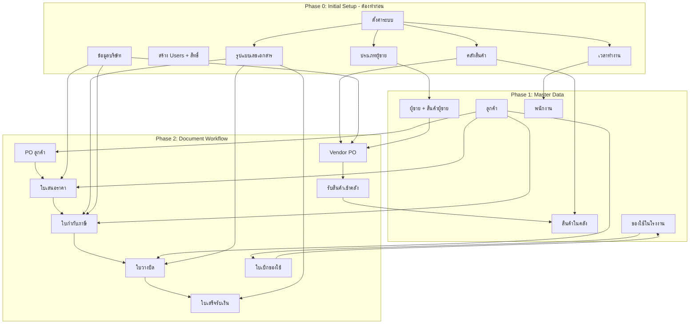

# Factory Dashboard - Comprehensive User Acceptance Test (UAT) Script

เอกสารนี้คือ Test Script สำหรับการทดสอบระบบแบบ **ละเอียดขั้นสุด (Exhaustive Testing)** ครอบคลุมทั้ง Positive Case (ทำงานปกติ), Negative Case (ทำงานเมื่อกรอกข้อมูลผิด), และ Edge Case (กรณีสุดวิสัย) เพื่อให้มั่นใจว่าระบบเสถียรและไร้ข้อผิดพลาด

---

## 🤖 Automated Bot Testing (การทดสอบอัตโนมัติด้วยบอท)

ระบบนี้รองรับการทดสอบอัตโนมัติ (Automated Bot Testing / Smoke Test) เพื่อช่วยยืนยันความถูกต้องและการเข้าใช้งานหน้าจอต่างๆ อย่างรวดเร็ว

### ข้อมูลสำหรับเข้าใช้งานระบบของ Bot (Bot Credentials)
*   **Username:** `admin_bell`
*   **Password:** `bellbabl1.`

### ขั้นตอนการทดสอบของ Bot (Bot Testing Flow)
1.  **เข้าสู่ระบบ (Login & Honeypot Bypass):**
    *   เข้าหน้าจอล็อกอิน (`/login`)
    *   กรอกชื่อผู้ใช้ (`admin_bell`) และรหัสผ่าน (`bellbabl1.`)
    *   *ระบบป้องกันพิเศษ:* บอทละเว้นการกรอกฟิลด์ดักจับบอท (`website_url_confirm` ซึ่งเป็น Honeypot แบบซ่อน) ทำให้เข้าสู่ระบบได้สำเร็จประหนึ่งผู้ใช้จริง
    *   ตรวจสอบการรีไดเรกต์เข้าสู่หน้า Dashboard หลัก (`/dashboard`)
2.  **การเข้าถึงเมนูและการโหลดข้อมูล (Navigation & Loading Verification):**
    *   บอทจะจำลองการกดขยายเมนูแบบยุบได้ (Collapsible Sidebar Menus) ทั้ง 3 หมวดหมู่หลัก และกดเข้าตรวจสอบหน้าจอดังต่อไปนี้:
        *   **คลังสินค้าและการผลิต (Warehouse & Production):** เข้าหน้า *คลังสินค้า (Warehouse)* และ *ของใช้ในโรงงาน (Internal Items)*
        *   **คู่ค้าและพนักงาน (Partners & Personnel):** เข้าหน้า *ลูกค้า (Customers)* และ *รายชื่อพนักงาน (Employees)*
        *   **ตั้งค่าระบบ (System Settings):** เข้าหน้า *ข้อมูลบริษัท (Company Info)* และ *สิทธิ์การใช้งาน (User Permissions)*
    *   *การตรวจสอบความถูกต้อง:* ในแต่ละหน้า บอทจะรอให้ตัวโหลดข้อมูล (Loading Spinner) ทำงานจนเสร็จสิ้น และตรวจสอบว่าหน้าจอแสดงผลข้อมูลได้ถูกต้อง ไม่มีหน้าว่างเปล่า (Blank Page) หรือ JavaScript Crash เกิดขึ้น
3.  **การจัดการข้อมูลผู้ขาย (Supplier CRUD Bot Test):**
    *   รันสคริปต์ `node scripts/uat/suppliers/supplier_bot_test.js`
    *   บอทจะล็อกอินแล้วนำเข้าสู่หน้าจอ `/dashboard/suppliers`
    *   กด "เพิ่ม Supplier" และกรอกข้อมูลสุ่ม (เช่น รหัส `SUP-XXXX` และ ชื่อ `บริษัท ทดสอบจัดส่ง จำกัด (XXXX)`)
    *   บันทึกข้อมูล และค้นหาข้อมูลจากแถวตารางในหน้ารายการ
    *   กด "แก้ไข" เพื่อเปลี่ยนข้อมูลเครดิตเทอมเป็น 45 วัน แล้วบันทึกการแก้ไข
    *   กด "ลบ" ข้อมูลผู้ขายทดสอบ และกดยืนยันเพื่อนำข้อมูลออกสำเร็จ

### 📹 วิดีโอบันทึกการทดสอบด้วย Bot (UAT Bot Test Run Video)
บอททดสอบ UAT ได้ทำการรันและทดสอบระบบผ่านสำเร็จเรียบร้อย 100% คุณสามารถเปิดดูคลิปบันทึกการทำงานของบอทเพื่อตรวจสอบได้ที่:
*   [วิดีโอบันทึกการรัน UAT Bot Test (WebP Format)](file:///Users/bell/.gemini/antigravity/brain/f794f5e0-d2da-4312-aa2c-1326e3011582/uat_bot_test_1779159492350.webp)

---

## 📊 Dependency Map — ลำดับตั้งค่าและความสัมพันธ์ระหว่างเมนู

### สรุปลำดับการตั้งค่าที่ถูกต้อง
| ลำดับ | ทำอะไร | ทำไมต้องทำก่อน |
|---|---|---|
| 1 | ข้อมูลบริษัท (Company Info) | ปรากฏบนหัวเอกสารทุกใบ (Invoice, PO, ใบเสนอราคา) |
| 2 | สร้าง Users + กำหนดสิทธิ์ | ควบคุมว่า User ไหนเห็น/ทำอะไรได้ |
| 3 | ตั้งค่าเวลาทำงาน | ใช้ในระบบพนักงาน (คำนวณสาย/OT) |
| 4 | ตั้งค่ารูปแบบเลขเอกสาร | Invoice, ใบวางบิล, ใบเสร็จ ใช้เลข auto-gen |
| 5 | เพิ่มประเภทผู้ขาย | ใช้ตอนสร้าง Supplier |
| 6 | สร้างคลังสินค้า | ใช้ตอนสร้าง Vendor PO (เลือกคลังปลายทาง) |
| 7 | สร้างลูกค้า | ใช้ในทุกเอกสาร (PO, ใบเสนอราคา, Invoice, ใบวางบิล) |
| 8 | สร้างผู้ขาย + สินค้าผู้ขาย | ใช้ตอนสร้าง Vendor PO |
| 9 | เพิ่มสินค้าในคลัง + BOM | ใช้ในระบบ Stock Card + Subcontract |

---

## 🏁 Phase 0: Initial Setup (ตั้งค่าระบบครั้งแรก)

### 0-1: Login ครั้งแรก + ตรวจสอบ Sidebar
| ID | Test Scenario | Test Steps | Expected Result | Status |
| :--- | :--- | :--- | :--- | :--- |
| SETUP-01 | เปิด URL ระบบ | 1. เปิด Browser → URL ระบบ | แสดงหน้า Login | |
| SETUP-02 | Login สำเร็จ (Admin) | 1. กรอก Username/Password ถูก → Login | เข้า Dashboard + มุมขวาบนแสดงชื่อ + นาฬิกาเวลาจริง | |
| SETUP-03 | ตรวจ Sidebar ครบ | 1. ดู Sidebar ทั้งหมด | เห็น: ภาพรวม, ใบสั่งซื้อ(PO), ใบเสนอราคา, ใบกำกับภาษี, ใบวางบิล, ใบเสร็จ, Vendor PO, กลุ่มคลังสินค้า, กลุ่มคู่ค้า, กลุ่มตั้งค่า | |
| SETUP-04 | ขยายกลุ่มเมนู | 1. กดขยาย "คลังสินค้าและการผลิต" 2. กดขยาย "คู่ค้าและพนักงาน" 3. กดขยาย "ตั้งค่าระบบ" | แต่ละกลุ่มแสดงเมนูย่อยครบ + Animation ขยาย/ยุบ smooth | |

### 0-2: ข้อมูลบริษัท (Company Info) — ต้องทำก่อนพิมพ์เอกสาร
| ID | Test Scenario | Test Steps | Expected Result | Status |
| :--- | :--- | :--- | :--- | :--- |
| SETUP-05 | เข้าหน้าข้อมูลบริษัท | 1. ตั้งค่าระบบ → ข้อมูลบริษัท | แสดงฟอร์มข้อมูลบริษัทปัจจุบัน | **Passed (Bot)** |
| SETUP-06-01 | บันทึกข้อมูลแบบกรอกครบทุกช่อง | 1. กรอกข้อมูลครบทุกช่อง (โลโก้, ชื่อ, ที่อยู่, โทร, แฟกซ์, อีเมล, เลขผู้เสียภาษี) 2. กดบันทึก | บันทึกสำเร็จ ข้อมูลอัปเดต รวมถึงวัน เวลา และผู้แก้ไข ได้รับการบันทึกและอัปเดตแสดงผลในหน้านั้น | **Passed (Bot)** |
| SETUP-06-02 | บันทึกข้อมูลแบบกรอกทุกช่อง ยกเว้นเบอร์แฟกซ์ | 1. กรอกข้อมูลทุกช่อง ยกเว้น เบอร์แฟกซ์ 2. กดบันทึก | บันทึกสำเร็จ ข้อมูลอัปเดต รวมถึงวัน เวลา และผู้แก้ไข ได้รับการบันทึกและอัปเดตตามปกติ (แฟกซ์เป็นข้อมูลไม่จำเป็นต้องใส่) | **Passed (Bot)** |
| SETUP-06-03 | บันทึกข้อมูลแบบเว้นว่างโลโก้ | 1. กรอกข้อมูลทุกช่อง ยกเว้น โลโก้ 2. กดบันทึก | บันทึกไม่สำเร็จ มี popup แจ้งเตือน "กรุณาอัปโหลดโลโก้บริษัท" | **Passed (Bot)** |
| SETUP-06-04 | บันทึกข้อมูลแบบเว้นว่างชื่อบริษัท | 1. กรอกข้อมูลทุกช่อง ยกเว้น ชื่อบริษัท 2. กดบันทึก | บันทึกไม่สำเร็จ มี popup แจ้งเตือน "กรุณากรอกชื่อบริษัท" | **Passed (Bot)** |
| SETUP-06-05 | บันทึกข้อมูลแบบเว้นว่างที่อยู่ | 1. กรอกข้อมูลทุกช่อง ยกเว้น ที่อยู่ 2. กดบันทึก | บันทึกไม่สำเร็จ มี popup แจ้งเตือน "กรุณากรอกที่อยู่บริษัท" | **Passed (Bot)** |
| SETUP-06-06 | บันทึกข้อมูลแบบเว้นว่างเบอร์โทรศัพท์ | 1. กรอกข้อมูลทุกช่อง ยกเว้น เบอร์โทรศัพท์ 2. กดบันทึก | บันทึกไม่สำเร็จ มี popup แจ้งเตือน "กรุณากรอกเบอร์โทรศัพท์" | **Passed (Bot)** |
| SETUP-06-07 | บันทึกข้อมูลแบบเว้นว่างอีเมล | 1. กรอกข้อมูลทุกช่อง ยกเว้น อีเมล 2. กดบันทึก | บันทึกไม่สำเร็จ มี popup แจ้งเตือน "กรุณากรอกอีเมลบริษัท" | **Passed (Bot)** |
| SETUP-06-08 | บันทึกข้อมูลแบบเว้นว่างเลขผู้เสียภาษี | 1. กรอกข้อมูลทุกช่อง ยกเว้น เลขประจำตัวผู้เสียภาษี 2. กดบันทึก | บันทึกไม่สำเร็จ มี popup แจ้งเตือน "กรุณากรอกเลขประจำตัวผู้เสียภาษี" | **Passed (Bot)** |
| SETUP-07 | **[Cross-check]** ข้อมูลบริษัทบนเอกสารพิมพ์ | 1. เปลี่ยนชื่อบริษัทในข้อมูลบริษัทเป็นชื่ออื่นชั่วคราว 2. ตรวจสอบหน้าเอกสารสำหรับพิมพ์ (ใบสั่งซื้อผู้ขาย PO, ใบเสนอราคา, ใบกำกับภาษี, ใบวางบิล, ใบเสร็จ) 3. ยืนยันว่าชื่อบริษัทเปลี่ยนตามที่แก้ไขทันที และไม่มีการ Hardcode ชื่อบริษัทเดิมค้างอยู่ในไฟล์โค้ด | หัวเอกสารแสดงชื่อและที่อยู่ใหม่ตามการอัปเดตแบบเรียลไทม์ และตรวจไม่พบชื่อเก่าที่เป็น Hardcode | **Passed (Bot)** |

### 0-3: สร้าง Users & กำหนดสิทธิ์
| ID | Test Scenario | Test Steps | Expected Result | Status |
| :--- | :--- | :--- | :--- | :--- |
| SETUP-08 | เข้าหน้าสิทธิ์ | 1. ตั้งค่าระบบ → สิทธิ์การใช้งาน | แสดงรายการ User + Admin ปัจจุบัน | |
| SETUP-08-01 | หน้า Listing: ข้อมูล | 1. ตรวจสอบตารางรายชื่อผู้ใช้งาน | แสดงปุ่มจัดการ, ชื่อ-นามสกุล+email, Username, เข้าใช้งานล่าสุดครบถ้วน | |
| SETUP-08-02 | หน้า Listing: ปุ่มจัดการตามสิทธิ์ | 1. ตรวจสอบปุ่มจัดการในตาราง | แสดงตามสิทธิ์ที่ให้ | |
| SETUP-08-03 | หน้า Listing: Super Admin | 1. ตรวจสอบแถวของ Super Admin | ไม่มีปุ่มลบในแถวนี้ และมี Super Admin เป็น default ตลอดไม่สามารถลบได้ | |
| SETUP-08-04 | หน้า Details: เข้าผ่านปุ่มจัดการ | 1. กดปุ่มจัดการ (icon รูปตา) จากหน้า listing | ไปหน้า details และโชว์ข้อมูลทั้งหมด | |
| SETUP-08-05 | หน้า Details: เข้าผ่านชื่อ | 1. กดตรงชื่อ จากหน้า listing | ไปหน้า details และโชว์ข้อมูลทั้งหมด | |
| SETUP-08-06 | หน้า Details: การแสดงผลข้อมูล | 1. ตรวจสอบข้อมูลในหน้า Details | แสดงตารางกำหนดสิทธิ์การใช้งาน, ข้อมูลของ user, ประวัติการเข้าใช้งาน | |
| SETUP-08-07 | หน้า Edit/Create: ข้อมูลทั่วไป | 1. แก้ไขข้อมูลทั่วไปทุก field 2. กดบันทึก | ข้อมูลอัปเดตอย่างถูกต้อง | |
| SETUP-08-08 | หน้า Edit/Create: กำหนดสิทธิ์ | 1. แก้ไขกำหนดสิทธิ์การใช้งานทุก checkbox 2. กดบันทึก | ข้อมูลอัปเดตและสิทธิ์ของแต่ละเมนูถูกนำไปใช้ | |
| SETUP-08-09 | หน้า Edit/Create: โชว์ผู้สร้าง/ผู้แก้ไข | 1. ตรวจสอบส่วนข้อมูล | โชว์ผู้สร้างและผู้แก้ไข | |
| SETUP-09 | สร้าง User B | 1. กด "เพิ่มผู้ใช้ใหม่" 2. กรอกชื่อ, username, password 3. ให้สิทธิ์: ✅ ดูลูกค้า, ✅ ดูคลัง, ❌ อื่นๆ 4. บันทึก | User B แสดงในรายการ | |
| SETUP-10 | Smart Permission | 1. ติ๊ก "แก้ไข" โดยไม่ติ๊ก "ดู" | ระบบติ๊ก "ดูข้อมูล" ให้อัตโนมัติ | |
| SETUP-11 | Anti-Self Lock | 1. Admin ลองเอาสิทธิ์ตัวเองออก | ไม่สามารถทำได้ (Disabled) | |
| SETUP-12 | Anti-Self Delete | 1. Admin ดูแถวตัวเองในตาราง | ไม่มีปุ่มลบ | |
| SETUP-13 | ทดสอบ User B | 1. Logout → Login User B 2. ตรวจ Sidebar | เห็นเฉพาะลูกค้า + คลังสินค้า | |
| SETUP-14 | URL Bypass ด้วย User B | 1. User B พิมพ์ URL `/dashboard/invoices` ตรง | Redirect ไปหน้าที่มีสิทธิ์ หรือ 403 | |
| SETUP-15 | กลับเป็น Admin | 1. Logout → Login Admin | เมนูครบ | |

### 0-4: ตั้งค่าระบบ (Settings)
| ID | Test Scenario | Test Steps | Expected Result | Status |
| :--- | :--- | :--- | :--- | :--- |
| SETUP-16 | เข้าหน้าตั้งค่า | 1. ตั้งค่าระบบ → ตั้งค่า | แสดง 5 ส่วนหลัก: เวลาทำงาน, กฎสาย, รูปแบบเลขเอกสาร, ประเภทผู้ขาย, คลังสินค้า | **Passed (Bot)** |
| SETUP-17-01 | ส่วนเวลาทำงาน (Working Hours) | 1. ตรวจสอบฟิลด์และลองบันทึกข้อมูลโดยเว้นว่างบางช่อง | จำเป็นต้องกรอกทุกช่อง (Required) หากขาดฟิลด์จะมีแจ้งเตือน | **Passed (Bot)** |
| SETUP-17-02 | ส่วนกฎการมาสาย (Late Penalty) | 1. ตรวจสอบฟิลด์และลองบันทึกข้อมูลโดยเว้นว่างบางช่อง | จำเป็นต้องกรอกทุกช่อง (Required) หากขาดฟิลด์จะมีแจ้งเตือน | **Passed (Bot)** |
| SETUP-18-01 | รูปแบบเลขที่เอกสาร Default | 1. ตรวจสอบค่าเริ่มต้นของรูปแบบเลขที่เอกสาร | ต้องมีค่าเริ่มต้น (Default) กำหนดมาให้เสมอ | **Passed (Bot)** |
| SETUP-18-02 | อัปเดตรูปแบบใบกำกับภาษี (Invoice) | 1. ปรับเปลี่ยนรูปแบบเลขที่ Invoice (เช่น IV{YY}{MM}{RUN}) → กดบันทึก 2. ไปหน้าสร้าง Invoice ใหม่ และตรวจสอบเลขรันนิ่งแรก | บันทึกสำเร็จ ข้อมูลอัปเดต และรหัสใบกำกับภาษี (Invoice No.) รันตามรูปแบบใหม่ที่ตั้งไว้ | **Passed (Bot)** |
| SETUP-18-03 | อัปเดตรูปแบบใบวางบิล (Billing Note) | 1. ปรับเปลี่ยนรูปแบบเลขที่ใบวางบิล (เช่น BN{YY}{MM}{RUN}) → กดบันทึก 2. ไปหน้าสร้างใบวางบิลใหม่ และตรวจสอบเลขรันนิ่งแรก | บันทึกสำเร็จ ข้อมูลอัปเดต และรหัสใบวางบิล (Billing Note No.) รันตามรูปแบบใหม่ที่ตั้งไว้ | **Passed (Bot)** |
| SETUP-18-04 | อัปเดตรูปแบบใบเสร็จรับเงิน (Receipt) | 1. ปรับเปลี่ยนรูปแบบเลขที่ใบเสร็จรับเงิน (เช่น RE{YY}{MM}{RUN}) → กดบันทึก | บันทึกสำเร็จ ข้อมูลอัปเดต และรหัสใบเสร็จรับเงินรันตามรูปแบบใหม่ที่ตั้งไว้ | **Passed (Bot)** |
| SETUP-19-01 | การตัดสต็อกอัตโนมัติ (Auto Stock Deduction) - เปลี่ยนคลัง | 1. แก้ไขเอกสารเปลี่ยนคลังเป้าหมาย 2. ดึงข้อมูลสินค้า 3. กดบันทึก | บันทึกได้สำเร็จ และตรวจสอบรายการสินค้าเข้าในคลังสินค้าใหม่ตามที่เลือก | **Passed (Bot)** |
| SETUP-19-02 | การตัดสต็อกอัตโนมัติ (Auto Stock Deduction) - เลือกคลัง | 1. สร้างเอกสารเลือกคลังเป้าหมาย 2. ดึงข้อมูลสินค้า 3. กดบันทึก | บันทึกได้สำเร็จ และตรวจสอบรายการสินค้าเข้าในคลังสินค้าตามที่ระบุ | **Passed (Bot)** |
| SETUP-20-01 | จัดการคลังสินค้า - คลัง Default | 1. ตรวจสอบตารางคลังสินค้า และพยายามลบคลัง Default | ต้องมีอย่างน้อย 1 คลัง Default อยู่เสมอ และระบบไม่อนุญาตให้ลบคลังนี้ออก | **Passed (Bot)** |
| SETUP-20-02 | จัดการคลังสินค้า - การกรอกข้อมูล | 1. ตรวจสอบฟอร์มเพิ่ม/แก้ไขคลังสินค้า | ทุกช่องเป็น Required (ต้องกรอก) ยกเว้นฟิลด์ "หมายเหตุ" | **Passed (Bot)** |
| SETUP-20-03 | จัดการคลังสินค้า - เพิ่มคลังของเราเอง | 1. กด "เพิ่มคลังใหม่" → เลือกประเภท "คลังของเราเอง" 2. กรอกข้อมูลคลัง → กดบันทึก | บันทึกได้สำเร็จ มีคลังใหม่แสดงผลในรายการพร้อมแสดงประเภทข้อมูลถูกต้อง | **Passed (Bot)** |
| SETUP-20-04 | จัดการคลังสินค้า - เพิ่มคลังของผู้ขาย | 1. กด "เพิ่มคลังใหม่" → เลือกประเภท "คลังของผู้ขาย (Supplier)" 2. กรอกข้อมูลคลัง → กดบันทึก | บันทึกได้สำเร็จ มีคลังใหม่แสดงผลในรายการพร้อมระบุคลังผู้ขายถูกต้อง | **Passed (Bot)** |
| SETUP-20-05 | จัดการคลังสินค้า - แก้ไขคลัง | 1. เลือกคลังจากรายการ → กดแก้ไขข้อมูล 2. เปลี่ยนแปลงข้อมูลและกดบันทึก | บันทึกสำเร็จ และข้อมูลที่แก้ไขอัปเดตแสดงผลในหน้ารายการทันที | **Passed (Bot)** |
| SETUP-20-06 | จัดการคลังสินค้า - ลบคลังและย้ายของ | 1. กดลบคลังสินค้าที่มีสินค้าอยู่ภายใน 2. ตรวจสอบ Popup แจ้งเตือนเรื่องการโอนย้ายสินค้า 3. เลือกคลังเป้าหมายสำหรับโอนย้าย → กดยืนยันการลบ | ลบคลังเก่าสำเร็จ และรายการสินค้าภายในคลังนั้นถูกย้ายไปยังคลังเป้าหมายที่เลือกไว้อย่างถูกต้อง | **Passed (Bot)** |
| SETUP-21-01 | ประเภทผู้ขาย (Supplier Categories) - เพิ่ม | 1. กดเพิ่มประเภทผู้ขายใหม่กรอกชื่อประเภท → บันทึก 2. ไปสร้างผู้ขายใหม่และเลือกประเภท | มีประเภทผู้ขายใหม่ที่เพิ่มแสดงในรายการตัวเลือกตอนสร้างผู้ขายสำเร็จ | **Passed (Bot)** |
| SETUP-21-02 | ประเภทผู้ขาย (Supplier Categories) - ลบ | 1. กดลบประเภทผู้ขายที่มีผู้ขายอ้างอิงอยู่ 2. ตรวจสอบ Popup แจ้งเตือนสิทธิ์ (ผู้ขายที่เคยใช้ประเภทนี้จะยังคงอยู่จนกว่าจะแก้ไข) 3. กดยืนยันการลบ 4. ตรวจสอบที่หน้ารายการผู้ขายและตอนสร้างผู้ขายใหม่ | ประเภทผู้ขายถูกลบออกจากระบบสำเร็จ โดยข้อมูลผู้ขายเดิมยังคงอยู่ตามแจ้งเตือน และไม่มีประเภทนี้ให้เลือกสร้างใหม่แล้ว | **Passed (Bot)** |
| SETUP-22 | บันทึกการตั้งค่ารวม | 1. กดปุ่ม "บันทึกการตั้งค่า" ใหญ่ด้านล่างของหน้าจอ | บันทึกและแสดง Alert "บันทึกการตั้งค่าเรียบร้อยแล้ว" | **Passed (Bot)** |

---

| ID | Test Scenario | Test Steps | Expected Result | Status |
| :--- | :--- | :--- | :--- | :--- |
| AUTH-01 | Login สำเร็จ | 1. กรอก Username ถูกต้อง 2. กรอก Password ถูกต้อง 3. กด Login | เข้าสู่หน้า Dashboard สำเร็จ, มุมขวาบนแสดงชื่อผู้ใช้งานถูกต้อง | **Passed (Bot)** |
| AUTH-02 | Login รหัสผิด | 1. กรอก Username ถูกต้อง 2. กรอก Password ผิด 3. กด Login | แจ้งเตือน "ชื่อผู้ใช้งานหรือรหัสผ่านไม่ถูกต้อง", ไม่เปลี่ยนหน้า | |
| AUTH-03 | Login ช่องว่าง | 1. ปล่อยว่าง Username หรือ Password 2. กด Login | UI แจ้งเตือนให้กรอกข้อมูล (Required Field) ห้ามยิง API | |
| AUTH-04 | Session Timeout | 1. Login สำเร็จ 2. ปล่อยหน้าจอทิ้งไว้ข้ามวัน (จำลองลบ LocalStorage) 3. กด Refresh | ระบบเตะออกและกลับมาหน้า Login อัตโนมัติ | |
| AUTH-05 | Bypass URL Protection | 1. Copy URL หน้าเมนู 'พนักงาน' 2. Login ด้วย User ที่ไม่มีสิทธิ์ 3. วาง URL แล้วกด Enter | ระบบดีดกลับหน้า Dashboard หรือหน้าที่มีสิทธิ์ และไม่พัง | |
| AUTH-06 | Hide Unauthorized UI | 1. Login ด้วย User ที่มีแค่สิทธิ์ 'ดูข้อมูล' ลูกค้า 2. ตรวจสอบเมนูและปุ่ม | ต้องไม่เห็นปุ่ม 'เพิ่ม', 'แก้ไข', 'ลบ' ทั่วทั้งระบบ | |

---

## 2. Overview Dashboard (หน้าจอภาพรวม)
| ID | Test Scenario | Test Steps | Expected Result | Status |
| :--- | :--- | :--- | :--- | :--- |
| DB-01 | KPI Accuracy | 1. ดูตัวเลขยอดขายรวมบน KPI Card 2. เทียบกับยอดรวม Invoice ในฐานข้อมูล | ตัวเลขตรงกันเป๊ะ, Format เป็นสกุลเงิน (มีลูกน้ำ), สีแสดงการเติบโตถูกต้อง | **Passed (Bot)** |
| DB-02 | Chart Data Toggle | 1. กดซ่อน/แสดง Metric (เช่น ยอดขาย, สต็อก) บนกราฟเส้น | เส้นกราฟโผล่และหายตามที่กด, แกน Y ปรับสเกลอัตโนมัติ | |
| DB-03 | Chart Date Range | 1. เปลี่ยนช่วงเวลาเป็น 'เดือนนี้', 'ปีนี้', 'กำหนดเอง' 2. ลองใส่วันเริ่มต้น > วันสิ้นสุด | กราฟอัปเดตถูกต้อง, ถ้าใส่วันผิดต้องมีแจ้งเตือนหรือปรับให้ถูกต้อง | |
| DB-04 | PO Delivery Alert | 1. ดูตาราง 'ใบสั่งซื้อที่ใกล้กำหนดส่ง' 2. ตรวจสอบสีสถานะ (เหลือง=ใกล้, แดง=เลยกำหนด) | ข้อมูลต้องเรียงจากวันที่ใกล้วิกฤตที่สุดไปหาน้อย | **Passed (Bot)** |
| DB-05 | No Data State | 1. ลบข้อมูลในระบบให้หมด (หรือจำลอง DB ว่าง) 2. เข้าหน้า Dashboard | ต้องแสดงหน้า UI "ไม่มีข้อมูล" อย่างสวยงาม ไม่ขึ้น Error Code | |

---

## 3. Core Features (Server-Side Pagination & Filter Export)
*ใช้กับหน้ารายการหลักทั้งหมด ได้แก่ ลูกค้า, ผู้ขาย, พนักงาน, ใบเสนอราคา, ใบสั่งซื้อ, Vendor PO, ใบกำกับภาษี, ใบวางบิล, ใบเสร็จ*

| ID | Test Scenario | Test Steps | Expected Result | Status |
| :--- | :--- | :--- | :--- | :--- |
| CORE-01 | Server-Side Pagination Load | 1. เข้าหน้าข้อมูลหลัก เช่น 'ใบสั่งซื้อ(PO)' หรือ 'Vendor PO' 2. ดูแท็บ Network (XHR) 3. เปลี่ยนหน้า (Page 2) | ระบบทำการยิง Request API แบบ `range(50, 99)` และไม่โหลดข้อมูลทั้งหมดรวดเดียว, หน้าจอแสดงผลรายการ 50 รายการถัดไป | |
| CORE-02 | Filter Search & Pagination Reset | 1. พิมพ์ค้นหา หรือ เลือกวันที่ ที่มีหลายรายการ 2. สังเกตหน้าปัจจุบัน | หน้าปัจจุบันต้องถูกรีเซ็ตกลับเป็น หน้า 1 เสมอเมื่อมีการพิมพ์ค้นหา/เลือกวันที่ และ Request จะส่งไปยัง Server เพื่อดึงข้อมูลใหม่ | |
| CORE-03 | Export Excel with Filter | 1. กรองรายการตามคำค้นหาและวันที่ 2. กดปุ่ม 'Export Excel' | ระบบทำการดาวน์โหลดข้อมูลที่ตรงกับเงื่อนไขทั้งหมด (แม้จะเกิน 50 รายการ) โดยข้อมูลในไฟล์ตรงกับ Filter โดยไม่ติดข้อจำกัดของหน้าปัจจุบัน | |

---

## 4. CRM & SRM (ลูกค้าและซัพพลายเออร์)

### 4.1 ข้อมูลลูกค้า (Customer Data)
| ID | Test Scenario | Test Steps | Expected Result | Status |
| :--- | :--- | :--- | :--- | :--- |
| CS-CUST-01 | หน้า Listing: Export Excel | 1. กดปุ่ม export excel | export ข้อมูลของลูกค้าออกมา | |
| CS-CUST-02 | หน้า Listing: ปุ่มจัดการ | 1. ตรวจสอบปุ่มจัดการในตาราง | ตรงปุ่มจัดการ แสดงตาม permission | |
| CS-CUST-03 | หน้า Listing: ค้นหาและกรอง | 1. ค้นหาและกรองข้อมูลในหน้า listing | search ได้ และ filter ได้ | |
| CS-CUST-04 | หน้า Create: ข้อมูลครบ | 1. กรอกข้อมูลทุกช่อง 2. กดบันทึก | สร้างลูกค้าใหม่ได้ | |
| CS-CUST-05 | หน้า Create: Required | 1. กรอกข้อมูลที่ required ไม่ครบ (รหัสลูกค้า, ชื่อบริษัท, เลขประจำตัวผู้เสียภาษี, เบอร์โทรศัพท์, เครดิต (วัน), ที่อยู่) 2. กดบันทึก | สร้างลูกค้าใหม่ไม่ได้ | |
| CS-CUST-06 | หน้า Create: Optional | 1. กรอกข้อมูลที่ optional ไม่ครบ (สาขา, ชื่อผู้ติดต่อ, เบอร์แฟกซ์, อีเมล, หมายเหตุสำหรับเอกสาร) 2. กดบันทึก | สร้างลูกค้าใหม่ได้ | |
| CS-CUST-07 | หน้า Edit: แก้ไขข้อมูล | 1. แก้ไขข้อมูลบางช่อง 2. กดบันทึก | ข้อมูลต้องอัพเดต | |
| CS-CUST-08 | หน้า Details: Tab ข้อมูลลูกค้า | 1. เลือก tab ข้อมูลลูกค้า | จะโชว์ข้อมูลของลูกค้าทั้งหมดและแสดงรายการสินค้า และประวัติการสร้างและแก้ไข | |
| CS-CUST-09 | หน้า Details: เพิ่มสินค้า | 1. เลือก tab ข้อมูลลูกค้า → เพิ่มสินค้า 2. กรอกข้อมูล 3. กดเพิ่ม | ช่อง ชื่อสินค้า, รหัส SKU, หน่วย, ราคา/หน่วย ต้องเป็น required จากนั้นจะสามารถกดเพิ่มได้ | |
| CS-CUST-10 | หน้า Details: แก้ไขสินค้า | 1. เลือก tab ข้อมูลลูกค้า → แก้ไขสินค้า 2. กรอกข้อมูล 3. กดบันทึก | ช่อง ชื่อสินค้า, รหัส SKU, หน่วย, ราคา/หน่วย ต้องเป็น required จากนั้นจะสามารถกดบันทึกได้ | |
| CS-CUST-11 | หน้า Details: ลบสินค้า | 1. เลือก tab ข้อมูลลูกค้า → ลบสินค้า 2. กดยืนยัน | สามารถลบสินค้าได้ **แต่ถ้าสินค้าชิ้นนี้เคยโดนเรียกใช้ในใบ INV แล้ว ใน INV จะคงสินค้านั้นไว้เหมือนเดิม ใน INV ตัวนั้น สินค้าจะไม่หายไปจาก INV | |
| CS-CUST-12 | หน้า Details: Tab ประวัติ (เอกสาร) | 1. เลือก tab ประวัติการซื้อ (เอกสาร) 2. แสดงประวัติของแต่ละเดือน | แสดงกล่องภาพรวม 3 กล่องคือ ยอดซื้อรวมทั้งหมด, จำนวน PO ทั้งหมด, จำนวน INV ทั้งหมด แสดงประวัติของแต่ละเดือนและexport excel ประวัติของแต่ละเดือนได้ | |
| CS-CUST-13 | หน้า Details: Tab ประวัติ (สินค้า) | 1. เลือก tab ประวัติการซื้อ (สินค้า) 2. แสดง ประวัติการซื้อ (สินค้า) ของแต่ละเดือน | แสดง ประวัติการซื้อ (สินค้า) ของแต่ละเดือน | |
| CS-CUST-14 | หน้า Details: Export สินค้า | 1. เลือก tab ประวัติการซื้อ (สินค้า) 2. กด export excel | สามารถ export ได้ | |
| CS-CUST-15 | หน้า Details: Print สินค้า | 1. เลือก tab ประวัติการซื้อ (สินค้า) 2. กด พิมพ์รายงาน | สามารถแสดงพิมพ์รายงานได้ | |
| CS-CUST-16 | ข้อมูลลูกค้า: ลบลูกค้า | 1. กดลบลูกค้าที่เคยอ้างอิงในเอกสาร 2. กดยืนยันการลบ | ลบลูกค้าได้ แต่ถ้าลูกค้าเคยโดนโยงเข้ากับเอกสารนั้นแล้ว เอกสารนั้นๆจะคงชื่อลูกค้าไว้อยู่ รวมถึงสินค้าจะไม่โดนลบในเอกสารนั้นๆ | |

### 4.2 ข้อมูลอื่นๆ ใน CRM & SRM
| ID | Test Scenario | Test Steps | Expected Result | Status |
| :--- | :--- | :--- | :--- | :--- |
| CS-01 | Create Full Data | 1. กรอกข้อมูลลูกค้าครบทุกช่อง 2. กดบันทึก | บันทึกสำเร็จ, กลับมาหน้าตารางเห็นข้อมูลครบถ้วน | |
| CS-02 | Create Missing Required | 1. ปล่อยช่อง 'ชื่อบริษัท' ว่างไว้ 2. กดบันทึก | ขึ้นตัวแดงเตือนช่องที่บังคับกรอก ไม่บันทึกข้อมูล | |
| CS-03 | Duplicate Tax ID | 1. กรอกเลขผู้เสียภาษีที่ซ้ำกับลูกค้าที่มีอยู่แล้ว 2. กดบันทึก | ระบบแจ้งเตือน "เลขประจำตัวผู้เสียภาษีซ้ำ" (ถ้าตั้งค่าไว้) | |
| CS-04 | Long Text Handling | 1. กรอกชื่อบริษัทและที่อยู่ยาวมากๆ (200 ตัวอักษรขึ้นไป) 2. บันทึกและดูหน้าตาราง | ตารางไม่แตก, มีการตัดคำ (Truncate) หรือปัดบรรทัดอย่างเป็นระเบียบ | |
| CS-05 | Export to Excel | 1. พิมพ์ค้นหาคำว่า "บริษัท A" 2. กด Export Excel | ไฟล์ Excel ที่โหลดมาต้องมีเฉพาะ "บริษัท A" ไม่ใช่ทั้งหมด | |
| CS-06 | Customer Detail Tabs | 1. เข้าหน้าละเอียดลูกค้า 2. กดสลับแท็บ 'ข้อมูล', 'ประวัติการซื้อ (เอกสาร)', 'ประวัติการซื้อ (สินค้า)' | ข้อมูลเปลี่ยนตามแท็บ, โหลดข้อมูลถูกต้อง, UI ไม่ค้าง | |
| CS-07 | Individual Price List | 1. ในหน้าลูกค้า กดแท็บ 'ข้อมูล' 2. เพิ่ม/แก้ไข สินค้าเฉพาะราย (Product List) | บันทึกราคาแยกตามลูกค้าได้สำเร็จ, ราคาโผล่ตอนเปิดเอกสารใหม่ให้ลูกค้านี้ | |
| CS-08 | Document/Product Export | 1. ในหน้าละเอียดลูกค้า กด Export Excel (ทั้งแบบรวมและรายเดือน) | ไฟล์ Excel แยกชีตหรือข้อมูลถูกต้องตามช่วงเวลาที่เลือก | |
| CS-09 | Supplier Categories | 1. ในหน้า Supplier เช็คการแสดงผล 'ประเภทผู้ขาย' (Badges) | แสดงประเภท (เช่น วัสดุก่อสร้าง, ขนส่ง) ถูกต้องตามที่ตั้งค่าไว้ | |
| CS-10 | Supplier Price History | 1. ในหน้า Supplier แท็บสินค้า กดปุ่มไอคอน 'กราฟ (TrendingUp)' | แสดงประวัติการปรับราคา หรือรายการที่เคยซื้อจากเจ้านี้ในอดีต | |
| CS-11 | Data Integrity Check | 1. ลองกด 'ลบ' ลูกค้าหรือซัพพลายเออร์ที่ถูกนำไปใช้เปิด PO/Invoice แล้ว | ระบบต้องแจ้งเตือนว่า "ไม่สามารถลบได้เนื่องจากมีการอ้างอิงในเอกสารแล้ว" | |
| CS-12 | Summary KPI Cards | 1. ตรวจสอบยอดซื้อรวม (Total Purchase) ในหน้าละเอียดลูกค้า | ยอดเงินต้องเป็นผลรวมของ Invoice ทั้งหมดที่สถานะไม่ใช่ Cancelled | |
| CS-13 | Supplier CRUD Bot Test | 1. เข้าเมนู ผู้ขาย 2. กด เพิ่ม Supplier และกรอกข้อมูล 3. บันทึกข้อมูล ค้นหารายการ และกด แก้ไข 4. บันทึกการแก้ไข ตรวจเช็คค่า และกด ลบ ข้อมูล | ทำงานสำเร็จครบทุกขั้นตอนตาม E2E Flow (Create, Read, Update, Delete) ผ่าน UI โดยมี Dialog แจ้งเตือนยืนยัน | **Passed (Bot)** |

---

## 4. Document Management (เอกสาร PO, Invoice, Billing, etc.)
| ID | Test Scenario | Test Steps | Expected Result | Status |
| :--- | :--- | :--- | :--- | :--- |
| DOC-01 | Select Customer Auto-fill | 1. สร้าง Invoice ใหม่ 2. เลือกลูกค้าจาก Dropdown | ข้อมูลที่อยู่, เครดิต (วัน), และเลขประจำตัวผู้เสียภาษี โผล่มาอัตโนมัติ | |
| DOC-02 | Calculation Accuracy | 1. เพิ่มสินค้า A ราคา 100 ฿ จำนวน 3 ชิ้น 2. เพิ่มสินค้า B ราคา 50 ฿ จำนวน 2 ชิ้น 3. ใส่ส่วนลด 50 ฿ 4. เช็ค VAT 7% | Subtotal = 400, หลังหักส่วนลด = 350, VAT = 24.5, Grand Total = 374.5 ฿ | |
| DOC-03 | Decimal Edge Case | 1. ใส่ราคาสินค้า 10.555 ฿ | ระบบปัดทศนิยม 2 ตำแหน่งถูกต้อง (10.56) | |
| DOC-04 | Empty Item Validation | 1. ไม่เพิ่มสินค้าเลยแม้แต่รายการเดียว 2. กดบันทึก | ระบบแจ้งเตือน "กรุณาเพิ่มสินค้าอย่างน้อย 1 รายการ" | |
| DOC-05 | Print Template Fit | 1. เพิ่มสินค้า 15 รายการ (ให้ยาวเกิน 1 หน้า) 2. กดสั่งพิมพ์ | ระบบจัดหน้ากระดาษอัตโนมัติ (Pagination) ไม่ทับหัวกระดาษแผ่นที่ 2 | |
| DOC-06 | Thai Baht Text | 1. ยอดรวมคือ 1,005.50 ฿ | ข้อความสรุปต้องแสดง "หนึ่งพันห้าบาทห้าสิบสตางค์" ถูกต้อง | |
| DOC-07 | Status Flow Change | 1. เปลี่ยนสถานะ PO จาก 'Draft' -> 'Progressing' -> 'Completed' | ระบบอัปเดตสี Badge และนำไปแสดงใน Dashboard ถูกหมวดหมู่ | |
| DOC-08 | Pull from Reference | 1. สร้าง Invoice จาก PO ลูกค้า | รายการสินค้า, ราคา, จำนวน ถูกดึงจาก PO ครบถ้วนโดยไม่ต้องพิมพ์ใหม่ | |
| DOC-09 | Multi-Step PO Receipt | 1. เข้าหน้าแก้ไข/รับสินค้าของ PO 7777777777e 2. **ครั้งที่ 1**: รายการแรกรับ 80, รายการสองไม่รับ 3. **ครั้งที่ 2**: รายการแรกรับเพิ่ม 10 (รวม 90), รายการสองรับ 80 4. **ครั้งที่ 3**: รายการแรกรับเพิ่ม 15 (ระบบ clamp ที่ 100), รายการสองรับเพิ่ม 20 (รวม 100) | สถานะอัปเดตเป็น 'รับสินค้าบางส่วน' -> 'รับสินค้าบางส่วน' -> 'ได้รับสินค้าครบแล้ว', ยอดจำนวนรับเข้ารวมใน DB ถูกต้อง | **Passed (Bot)** |
| DOC-10 | Supplier PO Item Delete Button | 1. เข้าหน้าแก้ไข/สร้าง Supplier PO (`SupplierPoFormPage.jsx`)  2. ตรวจสอบตำแหน่งของปุ่มลบในตารางสินค้า  3. ตรวจสอบลักษณะและสีปุ่มลบ | ปุ่มลบต้องอยู่ **คอลัมน์ขวาสุด** เท่านั้น มีสีแดงใส `var(--error)` ไม่มีพื้นหลังและเส้นขอบ | |

---

## 5. Warehouse & Inventory (คลังสินค้าและสต็อก)

### 5.1 การจัดการคลังสินค้า (Warehouse Management)
| ID | Test Scenario | Test Steps | Expected Result | Status |
| :--- | :--- | :--- | :--- | :--- |
| WH-01 | ดูรายการคลังสินค้า | 1. เข้าเมนู "คลังสินค้า" | แสดงหน้ารายการคลัง, มี Tab ของแต่ละคลัง, คลัง Default มี highlight สีม่วง + badge "Default" | |
| WH-02 | สลับระหว่างคลัง | 1. กด Tab คลังอื่น (ไม่ใช่ Default) | Tab highlight เปลี่ยน + ข้อมูลคลัง (ที่อยู่, ผู้ติดต่อ, เบอร์โทร) อัปเดต + ตารางสินค้าโหลดใหม่ | |
| WH-03 | เพิ่มสินค้าในคลัง | 1. กดปุ่ม "เพิ่มรายการใหม่" 2. เลือกประเภท "วัตถุดิบ" 3. กรอก: ชื่อ="เหล็กทดสอบ", SKU="STL-001", จำนวน=100, หน่วย=KG, ขั้นต่ำ=10 4. กด "บันทึกรายการ" | Modal ปิด + Alert สำเร็จ + สินค้าปรากฏในตาราง + status="ปกติ" (สีเขียว เพราะ 100>10) | |
| WH-04 | เพิ่มสินค้าไม่กรอกชื่อ | 1. กดปุ่ม "เพิ่มรายการใหม่" 2. ปล่อยชื่อว่าง 3. กด "บันทึกรายการ" | ระบบแจ้งเตือนให้กรอกข้อมูลที่จำเป็น (Required Field), ไม่บันทึก | |
| WH-05 | แก้ไขสินค้าในคลัง | 1. กดปุ่ม Edit (ไอคอนดินสอ) ที่สินค้า 2. เปลี่ยนจำนวนจาก 100 เป็น 5 3. กด "บันทึกรายการ" | Modal ปิด + Alert สำเร็จ + ตารางแสดงจำนวน 5 + status เปลี่ยนเป็น "ของใกล้หมด" (เพราะ 5 ≤ 10) | |
| WH-06 | ลบสินค้าจากคลัง (ยืนยัน) | 1. กดปุ่ม Delete ที่สินค้า 2. กด "ตกลง" ในป๊อปอัพยืนยัน | สินค้าหายจากตาราง | |
| WH-07 | ลบสินค้าจากคลัง (ยกเลิก) | 1. กดปุ่ม Delete ที่สินค้า 2. กด "ยกเลิก" ในป๊อปอัพยืนยัน | สินค้ายังอยู่ในตาราง ไม่ถูกลบ | |
| WH-08 | ค้นหาสินค้าด้วยชื่อ | 1. พิมพ์ชื่อสินค้าในช่องค้นหา | ตารางกรองแสดงเฉพาะรายการที่ตรงกับคำค้น | |
| WH-09 | ค้นหาสินค้าด้วย SKU | 1. พิมพ์ SKU ในช่องค้นหา | ตารางกรองแสดงรายการที่ SKU ตรง | |
| WH-10 | ค้นหาแล้วลบคำค้น | 1. พิมพ์คำค้นแล้วลบคำค้นจนว่าง | กลับแสดงสินค้าทั้งหมด | |
| WH-11 | ดูคอลัมน์ "กำลังมาเพิ่ม" | 1. สร้าง PO สถานะ Draft ที่มีสินค้าชื่อตรงกับสินค้าในคลัง 2. กลับมาหน้าคลังสินค้า | คอลัมน์ "กำลังมาเพิ่ม" แสดงตัวเลข pending จาก PO | |
| WH-12 | Permission: ไม่มีสิทธิ์เพิ่ม | 1. Login ด้วย User ที่ไม่มีสิทธิ์ create ของ warehouses 2. เข้าหน้าคลังสินค้า | ไม่เห็นปุ่ม "เพิ่มรายการใหม่" | |
| WH-13 | Permission: ไม่มีสิทธิ์แก้ไข/ลบ | 1. Login ด้วย User ที่มีแค่สิทธิ์ view 2. เข้าหน้าคลังสินค้า | ไม่เห็นปุ่ม Edit และ Delete ในตาราง | |
| WH-14 | หน้ารายละเอียดคลัง | 1. เข้าหน้า /warehouses/:id | แสดงข้อมูลคลังเดียว + ตารางสินค้าของคลังนั้น | |

### 5.2 Stock Card / ประวัติความเคลื่อนไหว (Inventory History)
| ID | Test Scenario | Test Steps | Expected Result | Status |
| :--- | :--- | :--- | :--- | :--- |
| SC-01 | เข้าดู Stock Card | 1. กดปุ่ม Eye (ดูรายละเอียด) ที่สินค้าในหน้าคลัง | ไปหน้า InventoryHistory + แสดง KPI Cards 5 ใบ: คลัง, จำนวนคงเหลือ, กำลังมา(PO), รวมนำเข้า, รวมนำออก | |
| SC-02 | ปรับสต็อก: นำเข้า (+) | 1. กดปุ่ม "ปรับสต็อก" 2. เลือก "นำเข้า (+)" 3. กรอกจำนวน=500 + หมายเหตุ="ล็อตใหม่" 4. กด "บันทึก" | Modal ปิด + สต็อกเพิ่ม 500 + มีรายการ IN ใน Stock Card + KPI "รวมนำเข้า" เพิ่มขึ้น | |
| SC-03 | ปรับสต็อก: เบิกออก (-) | 1. กดปุ่ม "ปรับสต็อก" 2. เลือก "เบิกออก (-)" 3. กรอกจำนวน=20 + หมายเหตุ="ส่งงานลูกค้า" 4. กด "บันทึก" | สต็อกลด 20 + มีรายการ OUT ใน Stock Card + KPI "รวมนำออก" เพิ่มขึ้น | |
| SC-04 | ปรับสต็อก: เบิกออกเกินจำนวน | 1. สินค้ามีสต็อก 10 ชิ้น 2. กดปรับสต็อก เบิกออก(-) จำนวน=20 | ตรวจสอบ: ระบบแจ้งเตือน "สต็อกไม่เพียงพอ" หรือยอมให้ติดลบ (ขึ้นกับ Business Rule) | |
| SC-05 | ปรับสต็อก: กรอกจำนวน 0 | 1. กดปรับสต็อก 2. กรอกจำนวน=0 3. กดบันทึก | ระบบแจ้งเตือน "กรุณาระบุจำนวนที่ถูกต้อง" + ไม่บันทึก | |
| SC-06 | ปรับสต็อก: ค่าทศนิยม | 1. กดปรับสต็อก นำเข้า(+) 2. กรอกจำนวน=1.5 (สินค้าหน่วย KG) | รองรับทศนิยม + สต็อกเพิ่ม 1.5 + แสดงใน Stock Card | |
| SC-07 | ปรับสต็อก: ค่าติดลบ (-50) | 1. กดปรับสต็อก 2. กรอกจำนวน = -50 | ระบบบล็อคไม่ให้กรอกเลขติดลบ (input min=0) | |
| SC-08 | ปรับสต็อก: ไม่กรอกหมายเหตุ | 1. กดปรับสต็อก 2. กรอกจำนวนแต่ปล่อยหมายเหตุว่าง 3. กดบันทึก | ระบบแจ้งเตือนให้กรอกหมายเหตุ (required field) | |
| SC-09 | ปรับสต็อก: กด Double Click | 1. กรอกข้อมูลครบ 2. กดปุ่ม "บันทึก" 2 ครั้งเร็วๆ | ระบบบันทึกแค่ครั้งเดียว (ปุ่มต้อง disable ขณะ saving) | |
| SC-10 | ปรับสต็อก: กดยกเลิก Modal | 1. กดปุ่ม "ปรับสต็อก" → Modal เปิด 2. กด "ยกเลิก" หรือ กดปุ่ม X | Modal ปิด + สต็อกไม่เปลี่ยน | |
| SC-11 | บันทึกยอดเริ่มต้น | 1. เข้า Stock Card ของสินค้าที่ยังไม่มี log เลย 2. กดปุ่ม "บันทึกยอดเริ่มต้น" | มีรายการ IN ใน Stock Card = ยอด quantity ปัจจุบัน + remark "ยอดเริ่มต้น" | |
| SC-12 | ปุ่มยอดเริ่มต้นไม่แสดง | 1. เข้า Stock Card ของสินค้าที่มี log แล้ว | ปุ่ม "บันทึกยอดเริ่มต้น" ไม่แสดง | |
| SC-13 | ดูรายการ Stock Card Table | 1. เข้า Stock Card ของสินค้าที่มีประวัติ | ตารางแสดงครบ: วันที่/เวลา, ประเภท(เข้า/ออก), จำนวน, ยอดก่อนหน้า, ยอดหลังทำรายการ, ที่มา/อ้างอิง, ผู้ทำรายการ, หมายเหตุ | |
| SC-14 | กดลิงก์อ้างอิง PO | 1. ในตาราง Stock Card มีรายการที่มาจาก PO 2. กดลิงก์เลข PO สีน้ำเงิน | นำไปหน้ารายละเอียด PO ที่ถูกต้อง | |
| SC-15 | Empty State: ไม่มีประวัติ | 1. เข้า Stock Card ของสินค้าที่ไม่มี log | แสดง Empty State "ยังไม่มีประวัติความเคลื่อนไหว" + ปุ่มยอดเริ่มต้น | |
| SC-16 | พิมพ์ Stock Card | 1. กดปุ่ม "พิมพ์ Stock Card" | เปิด Browser Print Dialog + แสดงตาราง Stock Card พิมพ์ได้ | |

### 5.3 BOM Rules (สูตรการผลิต)
| ID | Test Scenario | Test Steps | Expected Result | Status |
| :--- | :--- | :--- | :--- | :--- |
| BOM-01 | เพิ่มสูตรการผลิต | 1. เข้า Stock Card ของวัตถุดิบ 2. กดปุ่ม "เพิ่มสูตรการผลิต" 3. เลือกสินค้าสำเร็จรูปจาก Dropdown 4. ใส่วัตถุดิบ=10, ผลิตได้=200 5. กด "บันทึก" | สูตรปรากฏในตาราง BOM Rules + คอลัมน์ "อัตราส่วนต่อ 1 ชิ้น" = 0.0500 | |
| BOM-02 | BOM Dialog Layout | 1. กด "เพิ่มการตั้งค่าสูตรการผลิต" 2. ตรวจสอบ Layout Modal | ช่อง "ใช้วัตถุดิบ" และ "ผลิตได้" อยู่แถวเดียวกัน มีไอคอนลูกศรตรงกลาง | |
| BOM-03 | เพิ่มสูตรไม่เลือกสินค้า | 1. กดเพิ่มสูตร 2. ไม่เลือก Finished Product 3. กดบันทึก | แจ้งเตือน "กรุณากรอกข้อมูลให้ครบถ้วน" | |
| BOM-04 | เพิ่มสูตรใส่ค่า 0 | 1. กดเพิ่มสูตร 2. เลือกสินค้า + ใส่วัตถุดิบ=0 หรือผลิตได้=0 3. กดบันทึก | แจ้งเตือนค่าต้องมากกว่า 0 (input min=0.0001/0.01) | |
| BOM-05 | เพิ่มสูตรซ้ำ (สินค้าเดิม) | 1. เพิ่มสูตรสำหรับสินค้า A สำเร็จแล้ว 2. กดเพิ่มสูตรอีกครั้ง เลือกสินค้า A 3. กดบันทึก | แจ้ง error "ข้อมูลอาจซ้ำซ้อน" | |
| BOM-06 | ลบสูตรการผลิต | 1. กดปุ่ม "ลบ" ที่สูตรใดๆ ในตาราง | ⚠️ **Known Bug**: Crash เพราะ `showConfirm` ไม่ได้ import — ถ้าแก้แล้ว: แสดง Confirm Dialog กดตกลง สูตรหาย | |
| BOM-07 | Empty State ไม่มีสูตร | 1. เข้า Stock Card ของสินค้าที่ไม่มี BOM | แสดง Empty State "ยังไม่มีการตั้งค่าสูตรการผลิตสำหรับวัตถุดิบรายการนี้" | |

### 5.4 เปิด PO จ้างผลิตจากหน้า Stock Card
| ID | Test Scenario | Test Steps | Expected Result | Status |
| :--- | :--- | :--- | :--- | :--- |
| SCPO-01 | เปิด PO จ้างผลิต | 1. เข้า Stock Card ของวัตถุดิบ 2. กดปุ่ม "เปิด PO ผลิต" | ไปหน้า PO Form + แสดงแผง Subcontract สีม่วงด้านบน + ชื่อวัตถุดิบที่จะเบิก | |
| SCPO-02 | คำนวณ BOM อัตโนมัติ | 1. จากหน้า PO Subcontract 2. เลือกสินค้าที่มี BOM Rule | ช่อง "วัตถุดิบที่ใช้ต่อชิ้น" คำนวณอัตโนมัติจากสูตร + จำนวนเบิกรวมแสดงด้านบน | |
| SCPO-03 | บันทึก PO จ้างผลิต + ตัดสต็อก | 1. กรอกรายการสินค้าครบ + เลือก status 2. กดบันทึก | PO ถูกสร้าง + สต็อกวัตถุดิบถูกหักออกจากคลังอัตโนมัติ + มี log OUT ใน Stock Card | |
| SCPO-04 | Subcontract สต็อกวัตถุดิบไม่พอ | 1. เปิด PO จ้างผลิต ที่ต้องใช้วัตถุดิบเกินสต็อก 2. กดบันทึก | ระบบแจ้งเตือนสต็อกไม่เพียงพอสำหรับการเบิก | |

---

## 6. ใบสั่งซื้อผู้ขาย / Vendor PO (Supplier Purchase Order)

### 6.1 หน้ารายการ PO (PO List)
| ID | Test Scenario | Test Steps | Expected Result | Status |
| :--- | :--- | :--- | :--- | :--- |
| VPO-01 | ดูรายการ PO ทั้งหมด | 1. เข้าเมนู "ใบสั่งซื้อผู้ขาย" | แสดง KPI Cards 4 ใบ (Draft, Partial, Completed, Cancelled) + ตาราง PO จัดกลุ่มตามเดือน-ปี พ.ศ. | |
| VPO-02 | กด Expand ดูรายการสินค้า | 1. กดที่แถว PO ใดๆ ในตาราง | แถวขยาย แสดงรายการสินค้าทั้งหมดใน PO (description, quantity, received, unit_price, amount) | |
| VPO-03 | กด Collapse | 1. กดแถวที่ขยายอยู่อีกครั้ง | แถวยุบกลับ | |
| VPO-04 | ค้นหาด้วยเลขที่ PO | 1. พิมพ์เลขที่ PO (เช่น "VPO2605") ในช่องค้นหา | กรองแสดงเฉพาะ PO ที่เลข PO ตรง | |
| VPO-05 | ค้นหาด้วยชื่อผู้ขาย | 1. พิมพ์ชื่อผู้ขายในช่องค้นหา | กรองได้ตามชื่อ Supplier | |
| VPO-06 | ค้นหาด้วยชื่อสินค้าใน PO | 1. พิมพ์ชื่อสินค้าที่อยู่ในรายการ PO items | กรอง PO ที่มีสินค้าชื่อนั้น (ค้นข้ามลงไปใน items) | |
| VPO-07 | ค้นหาไม่เจอ | 1. พิมพ์คำค้นที่ไม่มีในระบบ (เช่น "ZZZZZ") | ตารางว่าง + แสดง Empty State สวยงาม | |
| VPO-08 | กรองด้วยวันที่สั่งซื้อ | 1. เลือกวันที่เริ่มต้น-สิ้นสุด ในช่อง "วันที่สั่งซื้อ" | แสดงเฉพาะ PO ที่วันที่สั่งอยู่ในช่วง | |
| VPO-09 | กรองด้วยวันกำหนดส่ง | 1. สลับ Dropdown เป็น "วันกำหนดส่ง" 2. เลือกช่วงวันที่ | แสดงเฉพาะ PO ที่ delivery_date อยู่ในช่วง | |
| VPO-10 | ล้างตัวกรอง | 1. กรองด้วยวันที่ + ค้นหา 2. กดปุ่ม "ล้างตัวกรอง" | กลับแสดง PO ทั้งหมด + ช่องค้นหาว่าง + วันที่ reset | |
| VPO-11 | Export Excel ทั้งหมด | 1. กดปุ่ม "Export All" | ดาวน์โหลดไฟล์ .xlsx ที่มีข้อมูล PO ทุกรายการ | |
| VPO-12 | Export Excel รายเดือน | 1. กดปุ่ม "ส่งออก Excel" ที่หัวกลุ่มเดือนใดๆ | ดาวน์โหลดไฟล์ .xlsx เฉพาะ PO ของเดือนนั้น | |
| VPO-13 | Permission: ไม่เห็นปุ่มสร้าง | 1. Login ด้วย User ที่ไม่มีสิทธิ์ create ของ supplier_pos | ไม่เห็นปุ่ม "สร้างใบสั่งซื้อใหม่" | |
| VPO-14 | Permission: ไม่เห็นปุ่มแก้ไข/ลบ | 1. Login ด้วย User ที่มีแค่สิทธิ์ view | ไม่เห็นปุ่ม Edit, Copy, Delete ในตาราง | |

### 6.2 สร้าง PO ใหม่ (Create PO)
| ID | Test Scenario | Test Steps | Expected Result | Status |
| :--- | :--- | :--- | :--- | :--- |
| VPO-20 | สร้าง PO Draft สำเร็จ | 1. กดปุ่ม "สร้างใบสั่งซื้อใหม่" 2. ปล่อยเลขที่ PO ว่าง (auto-gen) 3. เลือกผู้ขาย → สินค้าของผู้ขายโหลดเข้า datalist 4. เลือกคลังส่ง (default=คลังหลัก) 5. เลือกวันกำหนดส่ง, เครดิต, อ้างอิง 6. เพิ่มสินค้า 2 รายการจาก datalist 7. ตรวจสอบ auto-fill ราคา/หน่วย 8. กรอกผู้สั่งซื้อ + ผู้อนุมัติ 9. ตรวจยอดรวม 10. สถานะ = Draft กดบันทึก | Alert "สร้างใบสั่งซื้อสำเร็จ" + redirect ไปรายการ PO + เลข PO auto-gen (VPO{YYMM}{001}) | |
| VPO-21 | Auto-gen PO Number ไม่ซ้ำ | 1. สร้าง PO ใหม่ 2 ใบติดกันในเดือนเดียวกัน (ไม่กรอกเลข PO) | PO ใบแรก = VPO{YYMM}001, ใบที่สอง = VPO{YYMM}002 | |
| VPO-22 | เลือกผู้ขายแล้วเปลี่ยน | 1. เลือกผู้ขาย A → datalist โหลดสินค้า A 2. เลือกสินค้าของ A ลง items 3. เปลี่ยนเป็นผู้ขาย B | Datalist เปลี่ยนเป็นสินค้าของ B + สินค้าที่กรอกไว้ยังอยู่ | |
| VPO-23 | เลือกสินค้าจาก datalist | 1. พิมพ์ชื่อสินค้าในช่อง "รายการสินค้า" 2. เลือกจาก datalist | ราคา/หน่วย auto-fill จาก supplier_products + supplier_product_id ถูก set | |
| VPO-24 | พิมพ์สินค้าเอง (ไม่ผ่าน datalist) | 1. พิมพ์ชื่อสินค้าที่ไม่มีในรายการ 2. กรอกราคา/หน่วยเอง | บันทึกได้ปกติ (description เป็น free text) | |
| VPO-25 | เพิ่มรายการสินค้า (ปุ่ม +) | 1. กดปุ่ม "เพิ่มรายการ" หลายครั้ง | เพิ่มแถวใหม่ในตาราง + ลำดับอัปเดตถูกต้อง | |
| VPO-26 | ลบรายการสินค้า (ปุ่ม X) | 1. มีสินค้า 3 รายการ 2. กดปุ่ม X ที่แถวที่ 2 | แถวที่ 2 หายไป + ยอดรวมคำนวณใหม่ + เหลือ 2 รายการ | |
| VPO-27 | ลบรายการสุดท้าย | 1. เหลือสินค้า 1 รายการ 2. กดปุ่ม X | ตรวจว่าไม่สามารถลบรายการสุดท้ายได้ หรือแสดงเตือน | |
| VPO-28 | คำนวณยอดรวมอัตโนมัติ | 1. สินค้า A: จำนวน=10, ราคา=100 2. สินค้า B: จำนวน=5, ราคา=200 | Amount A=1,000 + B=1,000 → SUB TOTAL=2,000 → VAT 7%=140 → TOTAL=2,140 | |
| VPO-29 | แก้ไขอัตรา VAT | 1. เปลี่ยน VAT จาก 7 เป็น 0 | VAT Amount=0 + TOTAL=SUB TOTAL | |
| VPO-30 | แก้ VAT เป็น 3% | 1. เปลี่ยน VAT จาก 7 เป็น 3 | VAT คำนวณถูก 3% + TOTAL อัปเดต | |
| VPO-31 | อัปโหลดรูปภาพต่อรายการ | 1. กดปุ่ม Upload ที่รายการสินค้า 2. เลือกไฟล์รูป | แสดง Preview รูป + URL ถูก save | |
| VPO-32 | เพิ่ม Note ต่อรายการ | 1. กด Toggle Note ที่รายการสินค้า 2. พิมพ์ข้อความใน Note | Note ถูกบันทึกพร้อม PO Item | |
| VPO-33 | บันทึกไม่เลือกผู้ขาย | 1. กรอกข้อมูลแต่ไม่เลือกผู้ขาย 2. กดบันทึก | แจ้งเตือนให้เลือกผู้ขาย | |
| VPO-34 | บันทึกไม่กรอกสินค้า | 1. เลือกผู้ขาย + กรอก Header 2. ปล่อยรายการสินค้าว่าง 3. กดบันทึก | แจ้งเตือนให้เพิ่มรายการสินค้า | |
| VPO-35 | สร้าง PO status Completed ทันที | 1. สร้าง PO ใหม่ + เลือก "Completed" 2. สินค้า A จำนวน=50 3. กดบันทึก | PO ถูกสร้าง + สต็อกในคลังปลายทางเพิ่ม 50 ทันที + มี Log IN ใน Stock Card | |
| VPO-36 | ป้องกันกดซ้ำ (Double Submit) | 1. กรอกข้อมูลครบ 2. กดปุ่ม "บันทึก" 2 ครั้งเร็วๆ | บันทึกแค่ครั้งเดียว (ปุ่ม disable), ไม่เกิด PO ซ้ำ | |
| VPO-37 | กดย้อนกลับระหว่างกรอกข้อมูล | 1. กรอกข้อมูลไปครึ่งหนึ่ง 2. กดปุ่มย้อนกลับ | ตรวจว่ามี warning "มีข้อมูลที่ยังไม่ได้บันทึก" หรือออกทันที (current behavior) | |

### 6.3 แก้ไข PO (Edit PO)
| ID | Test Scenario | Test Steps | Expected Result | Status |
| :--- | :--- | :--- | :--- | :--- |
| VPO-40 | แก้ไข PO Draft | 1. เปิด PO สถานะ Draft กดปุ่ม "แก้ไข" 2. เปลี่ยนจำนวนสินค้า 3. กดบันทึก | PO อัปเดต + ยอดรวมคำนวณใหม่ + ไม่มี stock เปลี่ยน (ยัง Draft) | |
| VPO-41 | แก้ไข PO เพิ่ม/ลบรายการ | 1. แก้ไข PO → เพิ่มรายการใหม่ + ลบรายการเก่า 2. กดบันทึก | Items อัปเดตถูกต้อง (ลบเก่า+เพิ่มใหม่) | |
| VPO-42 | แก้ไข PO Completed (ที่รับไม่ครบ) | 1. PO สถานะ Completed แต่ items บางรายการ received < quantity 2. กดแก้ไข | เข้าหน้า Form ได้ + แสดงข้อมูล received_quantity | |
| VPO-43 | แก้ไข PO Cancelled | 1. พยายามแก้ไข PO ที่ Cancelled | ปุ่ม "แก้ไข" ไม่แสดง + ไม่สามารถเข้าหน้า Form ได้ | |

### 6.4 รับสินค้าเข้าคลัง (Receive Goods)
| ID | Test Scenario | Test Steps | Expected Result | Status |
| :--- | :--- | :--- | :--- | :--- |
| VPO-50 | รับสินค้าครั้งแรก (Draft → Partial) | 1. PO Draft กด "รับสินค้าเข้าคลัง" (จาก DetailPage) 2. แสดงคอลัมน์ "รับเพิ่มรอบนี้" 3. สินค้า A สั่ง 100 → กรอกรับ 30 4. สินค้า B สั่ง 50 → กรอกรับ 0 5. กดบันทึก | สถานะ = Partial + สต็อก A เพิ่ม 30 + มี Log IN | |
| VPO-51 | รับสินค้าครั้งที่ 2 (Partial → Partial) | 1. เปิด PO จาก VPO-50 กด "รับสินค้าเพิ่มเติม" 2. แสดง "รับแล้วรอบก่อน: 30" สำหรับ A 3. กรอกรับเพิ่ม A=20 + B=50 4. กดบันทึก | สต็อกเพิ่ม: A +20 (รวม 50), B +50 + สถานะยัง Partial | |
| VPO-52 | รับสินค้าครบ (Partial → Completed) | 1. เปิด PO จาก VPO-51 2. กรอกรับ A เพิ่ม 50 (รวม=100=สั่ง 100) 3. กดบันทึก | สถานะ = Completed + สต็อก A เพิ่มอีก 50 + ทุกรายการรับครบ | |
| VPO-53 | กรอกรับเกินจำนวนสั่ง | 1. สินค้าสั่ง 50, รับแล้ว 30 2. กรอก "รับเพิ่มรอบนี้" = 30 (จะเกินเป็น 60) | ระบบ clamp ที่ 20 (คงเหลือ 50-30=20) + แสดง Alert เตือน | |
| VPO-54 | รับสินค้า 0 ทุกรายการ | 1. เปิดหน้ารับสินค้า 2. กรอก "รับเพิ่มรอบนี้" = 0 ทุกรายการ 3. กดบันทึก | บันทึกได้แต่ไม่มี stock เพิ่ม + สถานะไม่เปลี่ยน | |
| VPO-55 | ตรวจ Stock Card หลังรับสินค้า | 1. หลังรับสินค้า PO ไปคลัง X 2. ไปดู Stock Card ของสินค้าที่รับในคลัง X | มี Log "IN" + reference_no = เลขที่ PO + remark "รับสินค้าจากใบสั่งซื้อเลขที่ ..." | |
| VPO-56 | สินค้าใหม่ที่ไม่มีในคลัง | 1. สร้าง PO Completed ที่มีสินค้าชื่อที่ไม่มีในคลังปลายทาง | ระบบสร้างรายการใหม่ในคลังอัตโนมัติ (product_type=material) + เพิ่ม stock | |

### 6.5 คัดลอก PO (Duplicate)
| ID | Test Scenario | Test Steps | Expected Result | Status |
| :--- | :--- | :--- | :--- | :--- |
| VPO-60 | คัดลอก PO | 1. ในหน้ารายการ PO กดปุ่ม Copy ที่ PO ใดๆ | ไปหน้า Form + ข้อมูล pre-filled + เลขที่ PO ว่าง + สถานะ Draft + วันที่เป็นวันนี้ | |
| VPO-61 | คัดลอก PO แล้วบันทึก | 1. คัดลอก PO 2. กดบันทึกโดยไม่แก้ | PO ใหม่ + PO number ใหม่ (auto-gen) + received_quantity reset เป็น 0 | |
| VPO-62 | คัดลอก PO แล้วแก้ไข | 1. คัดลอก PO 2. เปลี่ยนผู้ขาย + แก้ราคา 3. กดบันทึก | PO ใหม่ที่มีข้อมูลตามที่แก้ไข | |

### 6.6 ยกเลิก PO (Cancel)
| ID | Test Scenario | Test Steps | Expected Result | Status |
| :--- | :--- | :--- | :--- | :--- |
| VPO-70 | ยกเลิก PO Draft | 1. PO Draft กด "ยกเลิกรายการ" 2. ยืนยัน | สถานะ = Cancelled + ไม่กระทบ stock (เพราะยังไม่เคยรับ) | |
| VPO-71 | ยกเลิก PO Partial (stock พอ) | 1. PO Partial ที่รับ A=30, คลังมี stock A >= 30 2. กด "ยกเลิกใบสั่งซื้อ (หักสต็อกคืน)" 3. ยืนยัน | สถานะ = Cancelled + stock A ลด 30 + มี Log OUT "หักสต็อกออกเนื่องจากยกเลิก..." | |
| VPO-72 | ยกเลิก PO Completed (stock พอ) | 1. PO Completed รับ A=100, B=50, คลังมี stock พอ 2. กดยกเลิก 3. ยืนยัน | สถานะ = Cancelled + stock A ลด 100, B ลด 50 + Remark เติมข้อความยกเลิก | |
| VPO-73 | ยกเลิก PO แต่ stock ไม่พอ | 1. PO Completed ที่รับ A=100 2. คลังมี stock A เหลือ 30 (ถูกเบิกไปแล้ว) 3. กดยกเลิก | Error: "สต็อกสินค้า A ไม่เพียงพอ (ต้องการหักออก 100 แต่มีในคลัง 30)" | |
| VPO-74 | ยกเลิก PO ที่ Cancelled แล้ว | 1. เปิด PO สถานะ Cancelled | ปุ่มยกเลิกไม่แสดง | |
| VPO-75 | ยืนยันยกเลิกแล้วกดยกเลิก Dialog | 1. กดยกเลิก PO → แสดง Confirm 2. กด "ยกเลิก" ใน Confirm Dialog | ไม่มีอะไรเปลี่ยน + PO ยังอยู่สถานะเดิม | |

### 6.7 ลบ PO (Delete)
| ID | Test Scenario | Test Steps | Expected Result | Status |
| :--- | :--- | :--- | :--- | :--- |
| VPO-80 | ลบ PO Draft | 1. PO Draft กดปุ่ม "ลบ" + ยืนยัน | PO หายจากรายการ | |
| VPO-81 | ลบ PO Completed | 1. พยายามลบ PO Completed | Error: "ไม่สามารถลบใบสั่งซื้อที่รับสินค้าเข้าคลังแล้ว กรุณาใช้การยกเลิกแทน" | |
| VPO-82 | ⚠️ ลบ PO Partial | 1. PO Partial (รับสินค้าบางส่วนแล้ว) 2. กดลบ | ⚠️ **Known Bug**: ลบได้โดยไม่หัก stock คืน → stock เกินจริง (ควรบล็อกเหมือน Completed) | |
| VPO-83 | ลบ PO Cancelled | 1. พยายามลบ PO Cancelled | ปุ่ม "ลบ" ไม่แสดง (เฉพาะ Draft ถึงจะเห็นปุ่มลบ) | |
| VPO-84 | Permission: ไม่มีสิทธิ์ลบ | 1. Login ด้วย User ที่ไม่มีสิทธิ์ delete | ไม่เห็นปุ่ม "ลบ" แม้ PO จะเป็น Draft | |

### 6.8 หน้ารายละเอียด PO (Detail Page)
| ID | Test Scenario | Test Steps | Expected Result | Status |
| :--- | :--- | :--- | :--- | :--- |
| VPO-90 | ดูรายละเอียด PO | 1. กดปุ่ม "ดู" ที่ PO ในรายการ | แสดง: ผู้ขาย (ชื่อ/ที่อยู่/ผู้ติดต่อ/โทร), คลังส่ง, ตารางสินค้า, ยอดรวม, ข้อมูลจัดซื้อ, Timestamps | |
| VPO-91 | ดูจำนวนรับสินค้าในตาราง | 1. เปิด PO ที่ Partial/Completed | คอลัมน์จำนวนแสดง "(รับแล้ว: X)" สีเขียว | |
| VPO-92 | กดรูปภาพสินค้า | 1. PO ที่มีรูปภาพแนบ 2. กดที่รูป | เปิดรูปในหน้าต่างใหม่ (target="_blank") | |
| VPO-93 | ดูหมายเหตุ PO | 1. PO ที่มี remark | แสดงกล่องหมายเหตุด้านล่างตาราง | |
| VPO-94 | ตรวจสอบยอดรวม | 1. เทียบ SUB TOTAL, VAT, TOTAL กับรายการสินค้า | ตัวเลขถูกต้อง + format ฿X,XXX.XX | |
| VPO-95 | ข้อมูลจัดซื้อ Sidebar | 1. ดู sidebar ขวา "ข้อมูลการจัดซื้อ" | แสดง: วันที่สั่ง, กำหนดส่ง, เครดิต, อ้างอิง, ผู้สั่ง, ผู้อนุมัติ, สร้างเมื่อ, อัปเดตล่าสุด | |
| VPO-96 | ปุ่ม "รับสินค้าเข้าคลัง" (Draft) | 1. เปิด PO Draft | แสดงปุ่ม "รับสินค้าเข้าคลัง (Receive)" + "ยกเลิกรายการ" ใน sidebar | |
| VPO-97 | ปุ่ม "รับสินค้าเพิ่มเติม" (Partial) | 1. เปิด PO Partial | แสดงปุ่ม "รับสินค้าเพิ่มเติม" + "ยกเลิกใบสั่งซื้อ (หักสต็อกคืน)" | |
| VPO-98 | ปุ่มจัดการไม่แสดงเมื่อ Cancelled | 1. เปิด PO Cancelled | ไม่แสดงปุ่มจัดการเอกสารใดๆ (ไม่มีรับ/ยกเลิก) | |
| VPO-99 | กดย้อนกลับ | 1. กดปุ่มลูกศรย้อนกลับ ← | กลับหน้ารายการ PO | |

### 6.9 พิมพ์ PO (Print)
| ID | Test Scenario | Test Steps | Expected Result | Status |
| :--- | :--- | :--- | :--- | :--- |
| VPO-100 | เข้าหน้า Preview พิมพ์ | 1. จากหน้ารายละเอียด PO กดปุ่ม "พิมพ์ใบสั่งซื้อ" | ไปหน้า Preview มี control bar ด้านบน (ย้อนกลับ + พิมพ์) | |
| VPO-101 | ตรวจสอบข้อมูลบนเอกสาร | 1. ดูเนื้อหาเอกสาร | ครบ: Logo + ชื่อบริษัท, ผู้ขาย, วันที่, เลขที่ PO, กำหนดชำระ, วันส่ง, ตารางสินค้า, ยอดรวม, จำนวนเงินตัวอักษร, ผู้สั่ง/ผู้อนุมัติ, ช่องลายเซ็น | |
| VPO-102 | ⚠️ ตรวจสอบ ATTN field | 1. ดูฟิลด์ "ATTN:" ในเอกสาร | ⚠️ **Known Bug**: อาจแสดง "-" (ใช้ po.contact_person แทน supplier.contact_person) | |
| VPO-103 | ⚠️ Due Date ของแต่ละรายการ | 1. PO ที่มี item due_date ต่างกัน 2. ดูคอลัมน์ "กำหนดส่ง" แต่ละแถว | ⚠️ **Known Bug**: ทุกแถวแสดง po.delivery_date เหมือนกัน (ควรแสดง item.due_date) | |
| VPO-104 | กดปุ่มพิมพ์จริง | 1. กดปุ่ม "พิมพ์ใบสั่งซื้อ" ใน control bar | Browser Print Dialog เปิดขึ้น + เอกสาร A4 | |
| VPO-105 | กดย้อนกลับจากหน้าพิมพ์ | 1. กดปุ่ม "ย้อนกลับ" | กลับหน้ารายละเอียด PO | |
| VPO-106 | พิมพ์ PO ที่มีสินค้ามากกว่า 3 รายการ | 1. เปิดหน้าพิมพ์ PO ที่มี 5+ items | ตารางแสดงสินค้าครบ ไม่มีแถวว่างเติม (แถวว่างจะเติมเฉพาะกรณี < 3 items) | |
| VPO-107 | พิมพ์ PO ที่มีรูปภาพในรายการ | 1. PO มี image_url ในรายการ 2. ดูหน้า Print Preview | รูปแสดงในคอลัมน์ "รายการ" + ไม่เกินขอบ | |
| VPO-108 | จำนวนเงินเป็นตัวอักษร (Thai Baht) | 1. ยอดรวม = 1,005.50 บาท | แสดง "หนึ่งพันห้าบาทห้าสิบสตางค์" ถูกต้อง | |

---

## 7. Employees & Timesheet (พนักงานและการลงเวลา)
| ID | Test Scenario | Test Steps | Expected Result | Status |
| :--- | :--- | :--- | :--- | :--- |
| EMP-01 | Add Timesheet | 1. เลือกพนักงาน 2. ใส่เวลาเข้า 08:00, ออก 17:00 3. ใส่ OT 2 ชั่วโมง | บันทึกสำเร็จ, รวมเวลาทำงาน 8 ชั่วโมง (หักพักเที่ยง) + OT 2 ชั่วโมง | |
| EMP-02 | Overlapping Time | 1. บันทึกเวลา 08:00-17:00 วันที่ 1 2. พยายามบันทึกเวลา 12:00-18:00 ในวันที่ 1 ของพนักงานคนเดิม | ระบบเตือนว่ามีการลงเวลาซ้อนทับกันในวันนี้ | |
| EMP-03 | Cross-Month Timesheet | 1. ดูรายงาน Timesheet เลือกเดือนกุมภาพันธ์ (ปีอธิกสุรทิน) | ปฏิทินแสดงจำนวนวันถูกต้อง (28 หรือ 29 วัน) | |
| EMP-04 | Incomplete Time | 1. ใส่แค่เวลาเข้า แต่ไม่ใส่เวลาออก 2. กดบันทึก | แจ้งเตือนให้กรอกเวลาออก หรือถือว่าขาดงาน/คิดชั่วโมงไม่ได้ | |

---

## 8. Settings & System Administration (ผู้ดูแลระบบ)
| ID | Test Scenario | Test Steps | Expected Result | Status |
| :--- | :--- | :--- | :--- | :--- |
| SYS-01 | Anti-Self Lockout | 1. แอดมิน A ไปหน้าแก้สิทธิ์ของตัวเอง (แอดมิน A) 2. พยายามเอาติ๊ก 'แก้ไข' เมนูตั้งค่าออก | ไม่สามารถเอาติ๊กออกได้ (Disabled) | |
| SYS-02 | Anti-Self Deletion | 1. แอดมิน A ไปหน้า User List 2. หาแถวของแอดมิน A | ต้องไม่มีปุ่ม 'ถังขยะ' ให้กดลบ | |
| SYS-03 | Smart Permission | 1. แอดมินสร้าง User B 2. ติ๊กสิทธิ์ 'แก้ไข' ในเมนูคลังสินค้า โดยข้ามช่อง 'ดูข้อมูล' | ระบบติ๊กช่อง 'ดูข้อมูล' ให้อัตโนมัติ เพราะแก้ได้ต้องดูได้ | |
| SYS-04 | Change Company Info | 1. ไปหน้าตั้งค่า เปลี่ยนที่อยู่บริษัท และเลขประจำตัวผู้เสียภาษี | เอกสาร Invoice/PO ที่กดพิมพ์ใหม่ ต้องแสดงที่อยู่ใหม่ทันที | **Passed (Bot)** |
| SYS-05 | Change Theme/Logo | 1. (ถ้ามีฟีเจอร์) เปลี่ยนโลโก้บริษัทในตั้งค่า | โลโก้ใน Sidebar และเอกสารพิมพ์เปลี่ยนไปใช้ตัวใหม่ | |

---

## 9. Internal Items & Requisitions (ของใช้ในโรงงานและใบสั่งซื้อภายใน)
| ID | Test Scenario | Test Steps | Expected Result | Status |
| :--- | :--- | :--- | :--- | :--- |
| IR-01 | Create Requisition | 1. เลือกของใช้ภายใน 2. พิมพ์ชื่อสินค้าที่ไม่มีในระบบ 3. กด 'บันทึก' และกดยืนยันเพิ่มสินค้าใหม่ | สร้างใบสั่งซื้อสำเร็จ, สินค้าใหม่ถูกเพิ่มในฐานข้อมูลอัตโนมัติ | |
| IR-02 | Approver Notification | 1. สร้างใบสั่งซื้อด้วย User A 2. ล็อกอินด้วย User B (ที่มีสิทธิ์อนุมัติ) | เห็น Badge ตัวเลขที่กระดิ่ง Alerts, กดดูเห็นรายการของ User A | |
| IR-03 | Stock Receive & Cost | 1. ในหน้าใบสั่งซื้อ กด 'รับของเข้าสต๊อก' 2. กรอกราคาต้นทุนและจำนวนที่ได้รับจริง | สต๊อกสินค้าเพิ่มขึ้น, ราคาเฉลี่ยถูกบันทึก, สถานะเปลี่ยนเป็น 'Completed' | |
| IR-04 | Stock History (Audit) | 1. เข้าหน้ารายละเอียดสินค้า 2. กดดูแท็บ 'ประวัติความเคลื่อนไหว' | เห็นรายการ IN/OUT/ADJUST พร้อมชื่อผู้ทำรายการและเลขที่เอกสารอ้างอิง | |
| IR-05 | Permission Separation | 1. กำหนดสิทธิ์ User C ให้มีแค่ 'internal_items' 2. ตรวจสอบเมนู Sidebar | ต้องเห็นเมนูของใช้ในโรงงาน แต่ต้องไม่เห็นเมนูประวัติการเบิก/สั่งซื้อ | |
---

## 10. 🔍 Phase 3: Cross-Module Verification (ตรวจสอบผลลัพธ์ข้ามเมนู)

> **วัตถุประสงค์**: ตรวจสอบว่าข้อมูลที่สร้างในเมนูหนึ่ง ส่งผลถูกต้องในเมนูอื่น

### 10.1 Dashboard ภาพรวม — ตรวจทุก Tab
| ID | Test Scenario | Test Steps | Expected Result | Status |
| :--- | :--- | :--- | :--- | :--- |
| XMOD-01 | Tab ภาพรวม | 1. เข้า Dashboard → แท็บ "ภาพรวม" | KPI Cards (ยอดขาย, จำนวนเอกสาร) ถูกต้อง + กราฟแสดงข้อมูล | |
| XMOD-02 | Tab ใบสั่งซื้อ | 1. กดแท็บ "ใบสั่งซื้อ" | KPI + กราฟ + ตาราง PO ตรงกับที่สร้าง | |
| XMOD-03 | Tab ใบเสนอราคา | 1. กดแท็บ "ใบเสนอราคา" | KPI อัปเดตตาม | |
| XMOD-04 | Tab ใบกำกับภาษี | 1. กดแท็บ "ใบกำกับภาษี" | KPI + ยอดรวมตรงกับ Invoice ที่สร้าง | |
| XMOD-05 | Tab ใบวางบิล | 1. กดแท็บ "ใบวางบิล" | KPI + ข้อมูลถูกต้อง | |
| XMOD-06 | Tab ใบเสร็จ | 1. กดแท็บ "ใบเสร็จ" | KPI + ข้อมูลถูกต้อง | |
| XMOD-07 | Tab ลูกค้า | 1. กดแท็บ "ลูกค้า" | จำนวนลูกค้าตรง | |
| XMOD-08 | Tab ผู้ขาย | 1. กดแท็บ "ผู้ขาย" | จำนวนผู้ขายตรง | |
| XMOD-09 | Tab คลังสินค้า | 1. กดแท็บ "คลังสินค้า" | KPI สต็อกตรง (หลังเพิ่ม/หักทั้งหมด) | |
| XMOD-10 | Tab พนักงาน | 1. กดแท็บ "พนักงาน" | KPI + ข้อมูลเวลาทำงานตรง | |
| XMOD-11 | Tab ของใช้ในโรงงาน | 1. กดแท็บ "ของใช้ในโรงงาน" | KPI + ข้อมูลใบเบิกตรง | |
| XMOD-12 | Tab ปฏิทินงาน | 1. กดแท็บ "ปฏิทินงาน" | ปฏิทิน + เอกสารปรากฏบนวันที่ถูกต้อง | |

### 10.2 ลูกค้า → เอกสาร (Document Integrity)
| ID | Test Scenario | Test Steps | Expected Result | Status |
| :--- | :--- | :--- | :--- | :--- |
| XMOD-20 | PO → Invoice (ดึงรายการ) | 1. สร้าง Invoice → เลือกลูกค้าที่มี PO 2. เลือก PO จาก Dropdown | รายการสินค้า, ราคา, จำนวน ถูกดึงมาอัตโนมัติ + ไม่ต้องพิมพ์ใหม่ | |
| XMOD-21 | Invoice → ใบวางบิล | 1. สร้างใบวางบิล → เลือกลูกค้า | Dropdown แสดง Invoice ที่ยังไม่ถูกรวมเข้าใบวางบิล | |
| XMOD-22 | ใบวางบิล → ใบเสร็จ | 1. ดูรายละเอียดใบวางบิล → กด "บันทึกการรับเงิน" | สร้างใบเสร็จ + ใบวางบิลเปลี่ยนสถานะ "ชำระแล้ว" | |
| XMOD-23 | เลขที่เอกสาร auto-gen | 1. สร้าง Invoice 2 ใบในเดือนเดียวกัน | เลขรัน: IV2605001, IV2605002 (ตาม format ที่ตั้งใน Settings) | |
| XMOD-24 | ยอดลูกค้ารวม | 1. เข้ารายละเอียดลูกค้า | KPI "ยอดซื้อรวม" = ผลรวม Invoice ที่ไม่ Cancelled | |
| XMOD-25 | ประวัติเอกสารลูกค้า | 1. แท็บ "ประวัติเอกสาร" ของลูกค้า | เห็น PO, Invoice, ใบวางบิล ที่เกี่ยวข้อง | |
| XMOD-26 | ประวัติสินค้าลูกค้า | 1. แท็บ "ประวัติสินค้า" | เห็นสินค้าจาก Invoice + จำนวนรวมถูกต้อง | |

### 10.3 ผู้ขาย → Vendor PO → คลัง (Stock Integrity)
| ID | Test Scenario | Test Steps | Expected Result | Status |
| :--- | :--- | :--- | :--- | :--- |
| XMOD-30 | สินค้าผู้ขาย → Datalist | 1. สร้าง Vendor PO → เลือกผู้ขาย X | Datalist แสดงสินค้าที่เพิ่มไว้ในรายละเอียดผู้ขาย X | |
| XMOD-31 | ราคา Auto-fill จากผู้ขาย | 1. เลือกสินค้าจาก datalist | ราคา/หน่วย ตรงกับที่ตั้งไว้ใน Supplier Product | |
| XMOD-32 | PO Draft → คลัง "กำลังมาเพิ่ม" | 1. สร้าง PO Draft สินค้า A จำนวน 100 2. ไปดูคลังสินค้า | คอลัมน์ "กำลังมาเพิ่ม" แสดง 100 สำหรับสินค้า A | |
| XMOD-33 | รับสินค้า → Stock Card | 1. รับสินค้า PO → ไปดู Stock Card | มี Log "IN" + reference=เลข PO + remark ระบุ PO | |
| XMOD-34 | รับครบ → "กำลังมาเพิ่ม" เป็น 0 | 1. รับสินค้าครบ → ไปดูคลัง | คอลัมน์ "กำลังมาเพิ่ม" กลับเป็น 0 หรือ "-" | |
| XMOD-35 | ยกเลิก PO → หักสต็อกคืน | 1. ยกเลิก PO Completed → ไปดู Stock Card | มี Log "OUT" + remark "หักสต็อกออกเนื่องจากยกเลิก..." | |
| XMOD-36 | Stock balance ถูกต้อง | 1. ดู Stock Card ของสินค้าที่มีหลายรายการ | ผลรวม IN - OUT = จำนวนคงเหลือปัจจุบัน | |
| XMOD-37 | KPI "รวมนำเข้า" / "รวมนำออก" | 1. ดู KPI ใน Stock Card | ผลรวม IN = KPI นำเข้า, ผลรวม OUT = KPI นำออก | |
| XMOD-38 | ราคาผู้ขาย → Price History | 1. เข้ารายละเอียดผู้ขาย → แท็บสินค้า → กดไอคอนกราฟ | แสดงประวัติราคาจาก PO ที่เคยสั่ง | |

### 10.4 Subcontract (BOM → คลัง → Vendor PO)
| ID | Test Scenario | Test Steps | Expected Result | Status |
| :--- | :--- | :--- | :--- | :--- |
| XMOD-40 | BOM Rule → Subcontract Form | 1. เข้า Stock Card วัตถุดิบที่มี BOM 2. กด "เปิด PO ผลิต" | ไป Vendor PO Form + แผง Subcontract สีม่วง + ชื่อวัตถุดิบ | |
| XMOD-41 | BOM คำนวณอัตโนมัติ | 1. เลือกสินค้าที่มี BOM Rule | จำนวนเบิกวัตถุดิบคำนวณอัตโนมัติจากสูตร | |
| XMOD-42 | บันทึก Subcontract → หักสต็อก | 1. บันทึก PO Subcontract | สต็อกวัตถุดิบถูกหัก + มี Log OUT ใน Stock Card | |

### 10.5 ของใช้ในโรงงาน → ใบเบิก → Notification
| ID | Test Scenario | Test Steps | Expected Result | Status |
| :--- | :--- | :--- | :--- | :--- |
| XMOD-50 | สร้างใบเบิก → Notification | 1. สร้างใบสั่งซื้อของใช้ 2. ดูกระดิ่ง Alerts | Badge ตัวเลขเพิ่ม + กดเห็นรายการ | |
| XMOD-51 | อนุมัติใบเบิก → สต็อกเพิ่ม | 1. กดอนุมัติ + กรอกจำนวนรับ | สต็อกของใช้เพิ่ม + สถานะ Completed | |
| XMOD-52 | เวลาทำงาน → Settings | 1. ลงเวลาพนักงาน 08:00-17:00 | ชม.ทำงาน = 8 ชม. (ตาม Settings หักพัก 1 ชม.) | |

### 10.6 Export & Search ข้ามเมนู
| ID | Test Scenario | Test Steps | Expected Result | Status |
| :--- | :--- | :--- | :--- | :--- |
| XMOD-60 | Export ลูกค้า กรอง | 1. หน้าลูกค้า → ค้นหา "บริษัท A" → Export | ไฟล์ .xlsx มีเฉพาะข้อมูลที่กรอง | |
| XMOD-61 | Export Vendor PO ทั้งหมด | 1. หน้า Vendor PO → กด Export All | ไฟล์ .xlsx ข้อมูลครบ | |
| XMOD-62 | Export Vendor PO รายเดือน | 1. กด "ส่งออก Excel" ที่หัวกลุ่มเดือน | ไฟล์เฉพาะเดือนนั้น | |
| XMOD-63 | Export ประวัติลูกค้า | 1. หน้ารายละเอียดลูกค้า → Export Excel | ไฟล์ถูกต้อง (ทั้งรายรวมและรายเดือน) | |

---

## 11. 🛡 Phase 4: Edge Cases & Known Bugs

### 11.1 การลบข้อมูลที่มีการอ้างอิง
| ID | Test Scenario | Test Steps | Expected Result | Status |
| :--- | :--- | :--- | :--- | :--- |
| EDGE-01 | ลบลูกค้าที่มี PO/Invoice | 1. กดลบลูกค้า → ยืนยัน | Error: "ไม่สามารถลบได้เนื่องจากมีการอ้างอิงในเอกสาร" | |
| EDGE-02 | ลบผู้ขายที่มี Vendor PO | 1. กดลบผู้ขาย → ยืนยัน | Error เดียวกัน | |
| EDGE-03 | ลบคลัง Default | 1. ดูคลัง Default ในตาราง | ไม่มีปุ่มลบ (is_default=true) | |
| EDGE-04 | ลบประเภทผู้ขายที่มีคนใช้ | 1. ลบประเภทที่มี Supplier ใช้อยู่ | Error: "ไม่สามารถลบประเภทนี้ได้ เนื่องจากมีการใช้งานอยู่" | |

### 11.2 Vendor PO Edge Cases
| ID | Test Scenario | Test Steps | Expected Result | Status |
| :--- | :--- | :--- | :--- | :--- |
| EDGE-10 | ลบ PO Completed | 1. กดลบ PO Completed | Error: "ไม่สามารถลบใบสั่งซื้อที่รับสินค้าเข้าคลังแล้ว" | |
| EDGE-11 | ⚠️ ลบ PO Partial | 1. กดลบ PO Partial | ⚠️ **Known Bug**: ลบได้โดยไม่หักสต็อกคืน → สต็อกเกินจริง | |
| EDGE-12 | ยกเลิก PO สต็อกไม่พอ | 1. ยกเลิก PO ที่รับสินค้าแล้ว แต่สต็อกถูกเบิกไปแล้ว | Error: "สต็อกไม่เพียงพอสำหรับการยกเลิก" | |
| EDGE-13 | รับเกินจำนวนสั่ง | 1. สั่ง 50, กรอกรับ 60 | ระบบ clamp ไม่เกินจำนวนคงเหลือ + Alert | |
| EDGE-14 | Double Submit PO | 1. กรอกครบ → กดบันทึก 2 ครั้งเร็วๆ | บันทึก 1 ครั้ง (ปุ่ม disable) | |
| EDGE-15 | สร้าง PO ไม่เลือกผู้ขาย | 1. กรอกข้อมูลแต่ไม่เลือกผู้ขาย → บันทึก | แจ้งเตือนให้เลือกผู้ขาย | |
| EDGE-16 | สร้าง PO ไม่มีรายการสินค้า | 1. เลือกผู้ขาย แต่ไม่เพิ่มสินค้า → บันทึก | แจ้งเตือนให้เพิ่มสินค้า | |

### 11.3 Invoice & Auto Stock Deduction Edge Cases
| ID | Test Scenario | Test Steps | Expected Result | Status |
| :--- | :--- | :--- | :--- | :--- |
| EDGE-30 | สินค้าใหม่มีในคลังแต่ไม่มีในลูกค้า (INV) | 1. สร้าง Invoice พิมพ์ SKU ใหม่ที่ไม่มีใน `customer_products` แต่มีใน `warehouse_inventory` 2. บันทึก Invoice | Invoice บันทึกสำเร็จ, มี Alert หักสต็อก, ระบบ auto-create สินค้าเข้าไปใน `customer_products` ของลูกค้ารายนี้ | |
| EDGE-31 | สินค้าใหม่ไม่มีในทั้งสองที่ (INV) | 1. สร้าง Invoice พิมพ์ SKU ใหม่ที่ไม่มีในทั้ง `customer_products` และ `warehouse_inventory` 2. บันทึก Invoice | Invoice บันทึกสำเร็จ, ระบบ auto-create ลงทั้งสองที่, มีแจ้งเตือนการสร้างใหม่และหักสต็อกติดลบ | |
| EDGE-32 | แจ้งเตือนขายติดลบ (Negative Stock) | 1. สร้าง Invoice ด้วยสินค้าที่มีสต็อกในคลัง = 5 2. ใส่จำนวนขาย = 10 3. บันทึก Invoice | Invoice บันทึกสำเร็จ (อนุญาตให้ติดลบ), แสดง Dialog/Alert แจ้งเตือนยอดขายเกินสต็อก | |
| EDGE-33 | Permission ดูแจ้งเตือน | 1. Login ด้วย User ที่ไม่มีสิทธิ์ใน `inventory` 2. ตรวจสอบกระดิ่งแจ้งเตือนบน Header | ไม่พบแจ้งเตือน "สินค้าติดลบ" (เฉพาะ Admin หรือ User ที่มีสิทธิ์คลังเห็นเท่านั้น) | |

### 11.4 คลังสินค้า Edge Cases
| ID | Test Scenario | Test Steps | Expected Result | Status |
| :--- | :--- | :--- | :--- | :--- |
| EDGE-20 | ปรับสต็อก จำนวน=0 | 1. กดปรับสต็อก → กรอก 0 → บันทึก | Error: ไม่ให้กรอกค่า 0 | |
| EDGE-21 | ปรับสต็อก จำนวน=-50 | 1. กรอก -50 ในช่อง Input | Input ไม่ยอมรับค่าติดลบ (min=0) | |
| EDGE-22 | ปรับสต็อก ไม่กรอกหมายเหตุ | 1. กรอกจำนวนแต่ปล่อยหมายเหตุว่าง → บันทึก | Error: "กรุณากรอกหมายเหตุ" | |
| EDGE-23 | Double Click ปรับสต็อก | 1. กรอกครบ → กดบันทึก 2 ครั้งเร็วๆ | บันทึก 1 ครั้ง | |
| EDGE-24 | เบิกออกเกินสต็อก | 1. สต็อก=10, เบิก 20 | Error หรือยอมให้ติดลบ (ตาม Business Rule) | |
| EDGE-25 | ⚠️ ลบ BOM Rule | 1. กดลบสูตรการผลิต | ⚠️ **Known Bug**: Crash (`showConfirm` ไม่ได้ import) | |
| EDGE-26 | เพิ่มสินค้าไม่กรอกชื่อ | 1. กดเพิ่มรายการใหม่ → ปล่อยชื่อว่าง → บันทึก | แจ้งเตือน Required Field | |

### 11.4 Invoice / Quotation Edge Cases
| ID | Test Scenario | Test Steps | Expected Result | Status |
| :--- | :--- | :--- | :--- | :--- |
| EDGE-30 | ราคาทศนิยม 10.555 | 1. ใส่ราคาสินค้า 10.555 | ปัด 2 ตำแหน่ง → 10.56 | |
| EDGE-31 | ไม่เพิ่มสินค้า → บันทึก | 1. สร้าง Invoice ไม่เพิ่มสินค้า → บันทึก | Error: "กรุณาเพิ่มสินค้าอย่างน้อย 1 รายการ" | |
| EDGE-32 | สินค้า 15 รายการ → พิมพ์ | 1. เพิ่ม 15 รายการ → พิมพ์ | จัดหน้า A4 อัตโนมัติ ไม่ทับหัว | |
| EDGE-33 | จำนวนเงินตัวอักษร | 1. ยอดรวม 1,005.50 | "หนึ่งพันห้าบาทห้าสิบสตางค์" | |
| EDGE-34 | VAT 0% | 1. เปลี่ยน VAT เป็น 0 | Total = Subtotal | |

### 11.5 Print Edge Cases
| ID | Test Scenario | Test Steps | Expected Result | Status |
| :--- | :--- | :--- | :--- | :--- |
| EDGE-40 | ⚠️ Vendor PO Print: ATTN | 1. ดูฟิลด์ "ATTN:" บนเอกสาร Vendor PO | ⚠️ **Known Bug**: แสดง "-" (ใช้ po.contact_person แทน supplier) | |
| EDGE-41 | ⚠️ Vendor PO Print: Due Date per item | 1. PO ที่แต่ละ item มี due_date ต่างกัน | ⚠️ **Known Bug**: ทุกแถวแสดง po.delivery_date เหมือนกัน | |
| EDGE-42 | Invoice Print: Company Info | 1. พิมพ์ Invoice | ข้อมูลบริษัทตรงกับ Company Info (หลังแก้ไข) | |

### 11.6 Session & Security
| ID | Test Scenario | Test Steps | Expected Result | Status |
| :--- | :--- | :--- | :--- | :--- |
| EDGE-50 | Login ผิดทั้ง Username/Password | 1. กรอก Username/Password ผิด → Login | Error: "ชื่อผู้ใช้งานหรือรหัสผ่านไม่ถูกต้อง" | |
| EDGE-51 | Login ฟิลด์ว่าง | 1. ปล่อยว่าง → Login | Error Required Field ไม่ยิง API | |
| EDGE-52 | Session Timeout จำลอง | 1. ลบ LocalStorage → Refresh | Redirect กลับหน้า Login | |
| EDGE-53 | URL Bypass ไม่มีสิทธิ์ | 1. User ที่ไม่มีสิทธิ์ paste URL ของเมนูอื่น | ไม่เข้าถึงได้ + Redirect | |
| EDGE-54 | ออกจากระบบ | 1. กดปุ่ม "ออกจากระบบ" | กลับหน้า Login | |

---

## ⚠️ Known Bugs Summary (ได้รับการแก้ไขแล้วในอัปเดตล่าสุด)

| Bug ID | Test ID | รายละเอียด | ระดับ | สถานะ |
|---|---|---|---|---|
| BUG-001 | EDGE-25 | ลบ BOM Rule → Crash (`showConfirm` ไม่ได้ import ใน `InventoryHistoryPage.jsx`) | 🔴 Critical | ✅ Fixed |
| BUG-002 | — | `updateStatus` ใน `supplierPoService.js` ใช้ `quantity` แทน `received_quantity` ทำให้สถานะ PO ผิดพลาด | 🔴 Critical | ✅ Fixed |
| BUG-003 | EDGE-11 | ลบ PO Partial ได้โดยไม่หักสต็อกคืน → สต็อกเกินจริง | 🔴 Critical | ✅ Fixed |
| BUG-004 | EDGE-40 | Print ATTN ใช้ `po.contact_person` แทน `supplier.contact_person` | 🟡 Medium | ✅ Fixed |
| BUG-005 | EDGE-41 | Print Due Date ทุกรายการแสดง `po.delivery_date` เหมือนกันหมด (ไม่ใช่ `item.due_date`) | 🟡 Medium | ✅ Fixed |

---

## 📊 สรุป Test Cases ตาม Phase & เมนู

| Phase | เมนู/กลุ่ม | จำนวน Cases | ความสัมพันธ์หลัก |
|---|---|---|---|
| **Phase 0** | Initial Setup (Login, Company, Users, Settings) | ~28 | → ทุกเมนู |
| **Phase 1** | Auth, Dashboard, CRM/SRM (ลูกค้า/ผู้ขาย), Documents | ~26 | → เอกสาร, Dashboard |
| **Phase 2** | Warehouse (41), Vendor PO (68) | ~109 | → คลัง, Stock Card, BOM |
| **Phase 3** | Employees, Settings, Internal Items | ~14 | → เวลาทำงาน, ใบเบิก |
| **Cross-Module** | Dashboard, Stock Integrity, Subcontract, Export | ~40 | ← ทุกเมนู |
| **Edge Cases** | Known Bugs, Security, Print | ~35 | ป้องกันข้อผิดพลาด |
| **รวม** | | **~250+** | |

---

## ✍️ สรุปการเซ็นอนุมัติ (Sign-off)
| หน้าที่ | ชื่อ | ลายเซ็น | วันที่ |
| :--- | :--- | :--- | :--- |
| **System Tester** | ________________ | ________________ | ___/___/___ |
| **Project Manager** | ________________ | ________________ | ___/___/___ |
| **Business Owner** | ________________ | ________________ | ___/___/___ |

